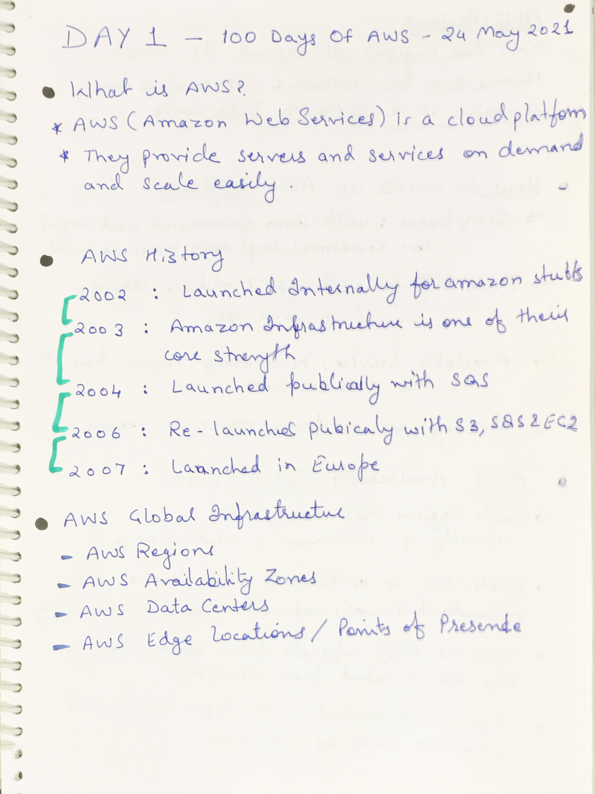
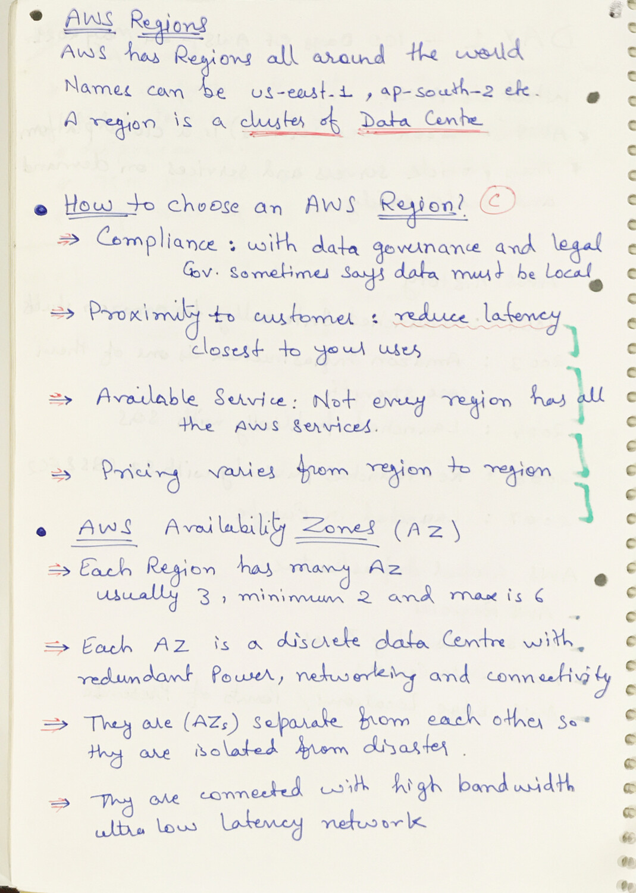
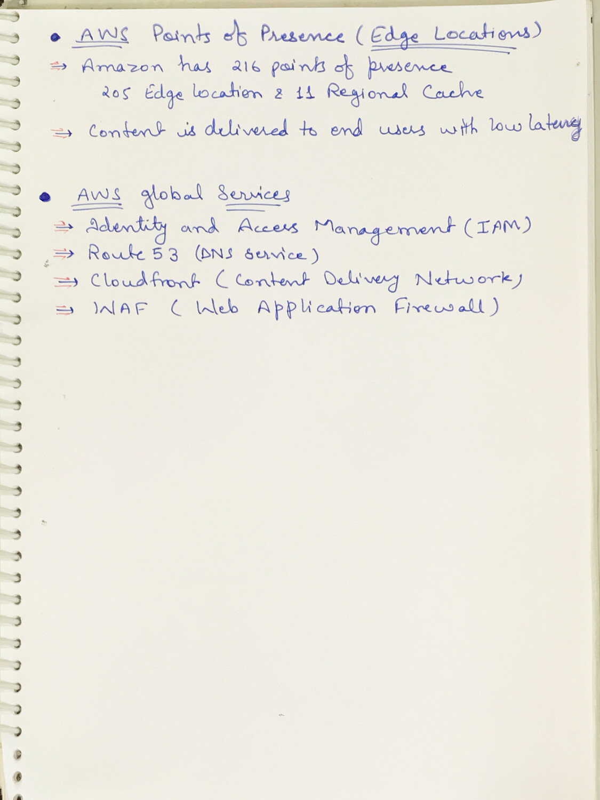

# Day 1 - Getting Started with AWS

**Congrats, since you are here this means you want to start AWS**

## What I have learned
I have started with the course I have given and completed the AWS Introduction.

## Hands on video

## Topic Covered
  - What is AWS
  - AWS History
  - AWS global Infrastructure
  - AWS Regions
  - How to Choose AWS Regions
  - AWS Availability Zones
  - Point of Presence or Edge Locations
  - AWS Global Services

## My Notes

