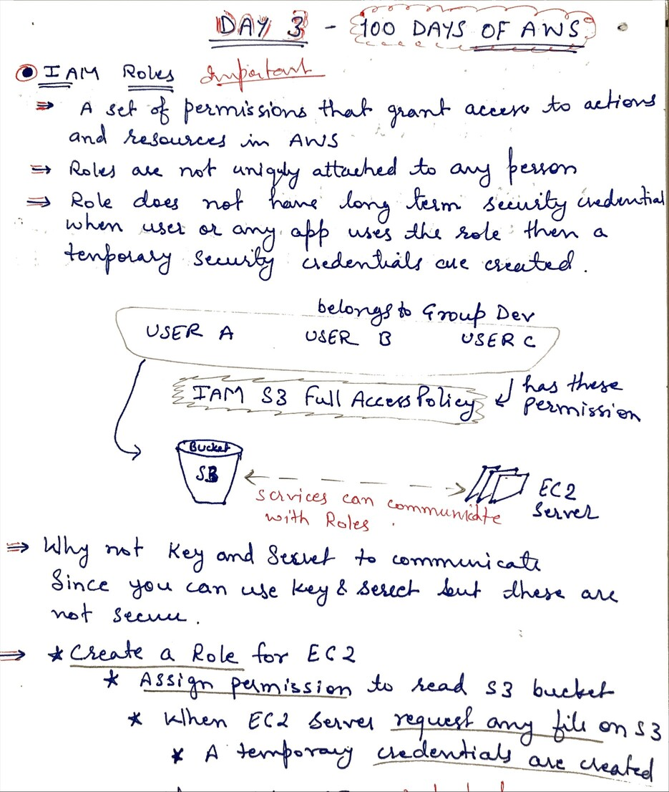
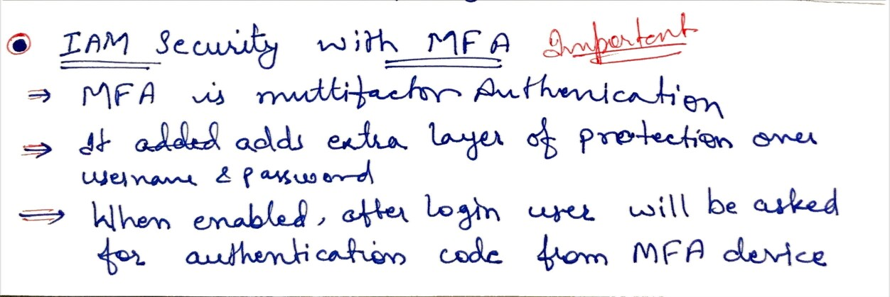
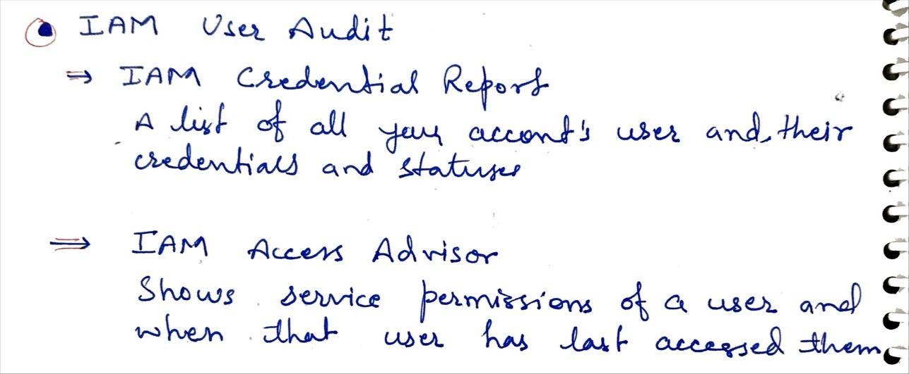

# Day 3 - IAM Role, MFA and User Audit Security

**Congrat, since you are here this means you have completed Day 2 and working on Day 3**

## Hands on video

## Topic Covered
  - IAM Roles
  - Why we need Roles
  - Steps to use Role for any AWS service
  - IAM Security with MFA
  - IAM Security User Audit

## My Notes
  ### IAM Roles and Its use case
  
  
  ### IAM Security with Multi Factor Authentication (MFA)
  
  
  ### IAM Security with User Audit
  
