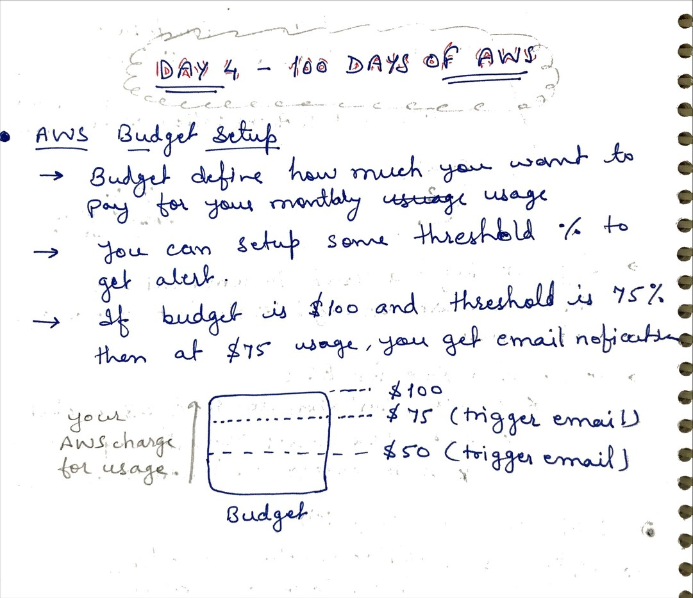
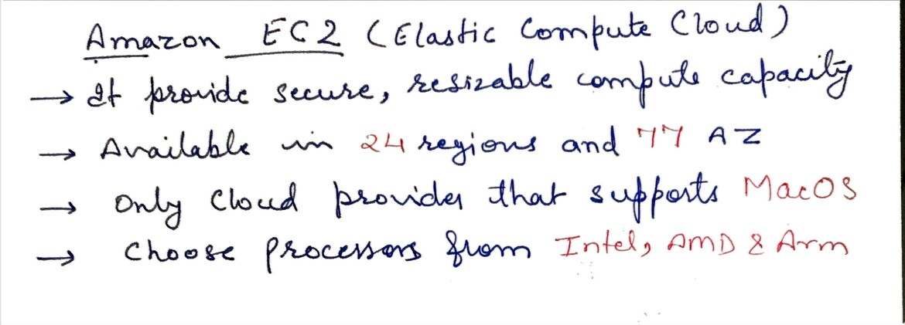
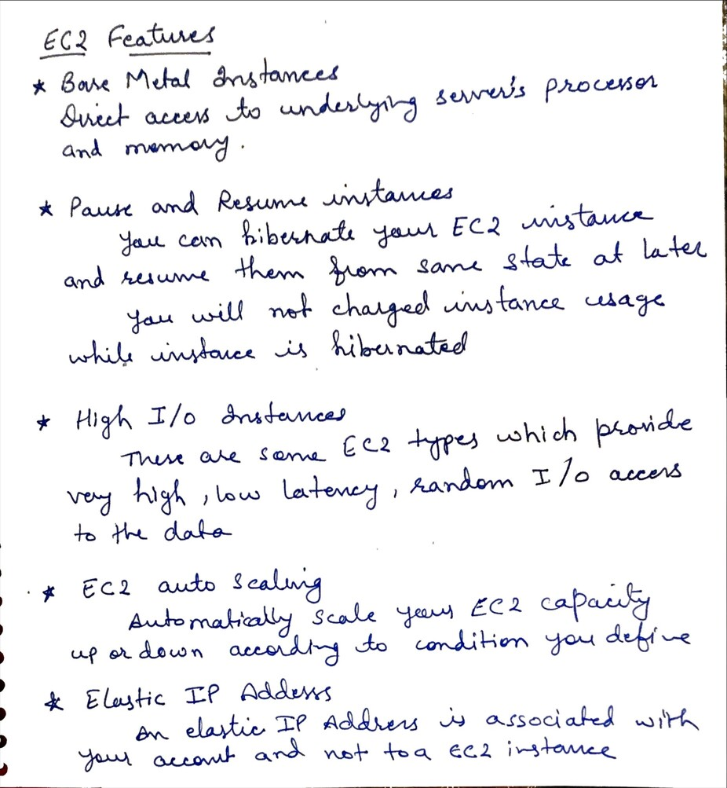
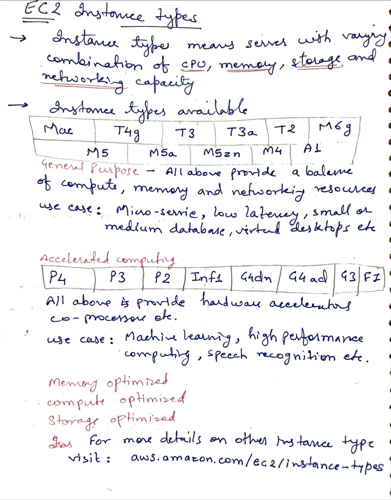

# Day 4 - Billing, Budget and EC2

**Congrat, since you are here this means you have completed Day 3 and working on Day 4**

## Hands on video

## Topic Covered
  - How to check billing
  - AWS Budget Setup
  - What is Amazon EC2
  - EC2 features
  - EC2 instance type

## My Notes

  ### AWS Budget and Billing
  

  ### AWS EC2 (Elastic Compute Cloud)
  

  ### EC2 features
  

  ### EC2 Instance Types
  
