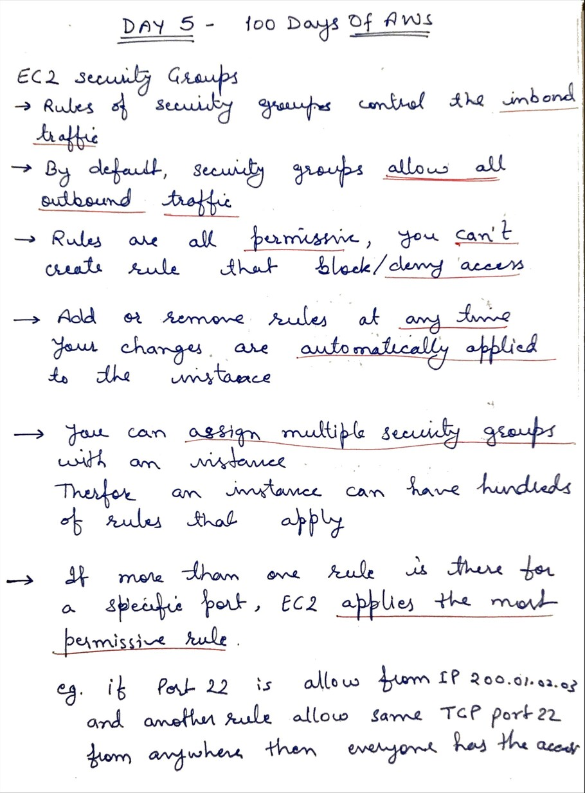
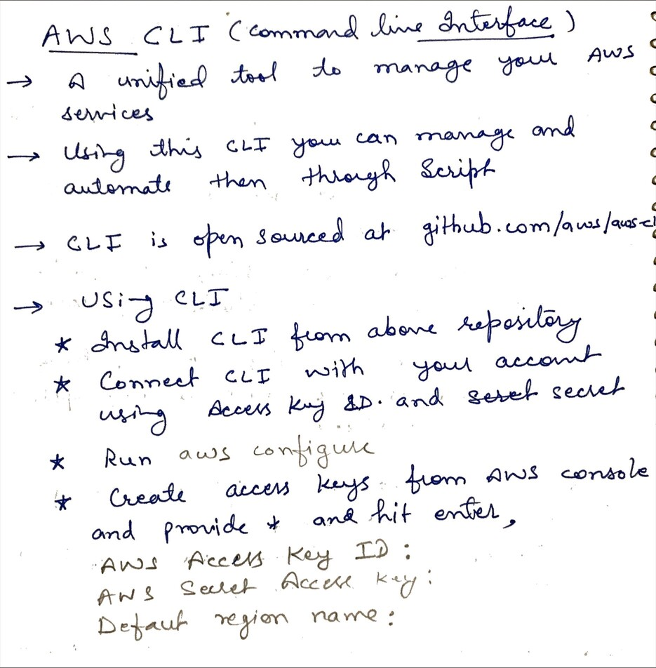
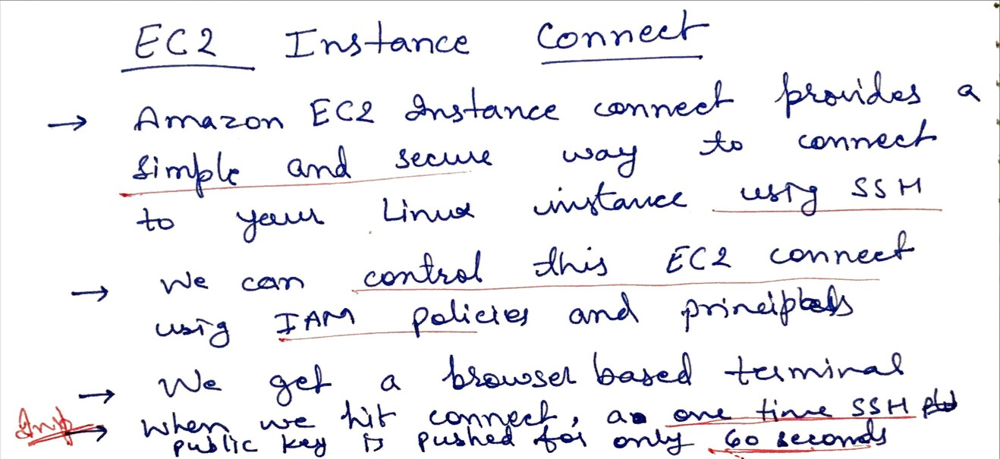

# Day 5 - Security Groups, AWS CLI and EC2 Connect

**Congrat, since you are here this means you have completed Day 4 and working on Day 5 **

## Hands on video

## Topic Covered
  - EC2 Security Groups
  - AWS CLI ( A Command Line Interface )
  - EC2 Instance Connect

## My Notes

  ### EC2 Security Groups
  

  ### AWS CLI (Command Line Interface)
  
  
  ### EC2 Instance CONNECT
  

