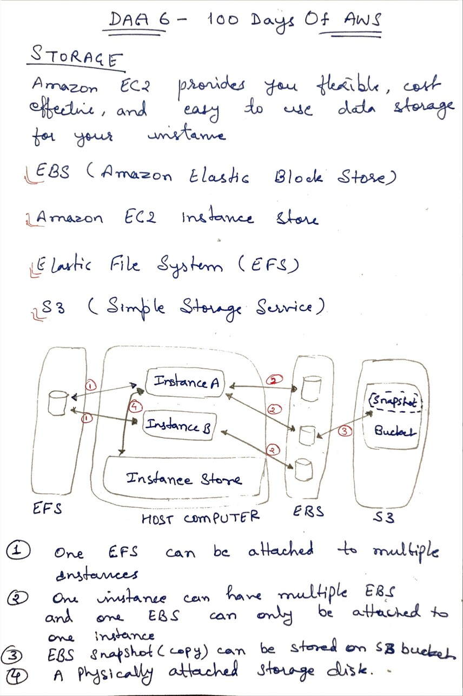
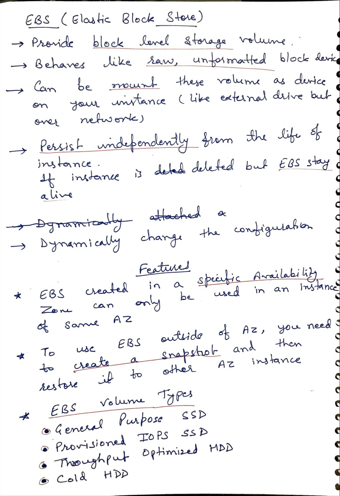
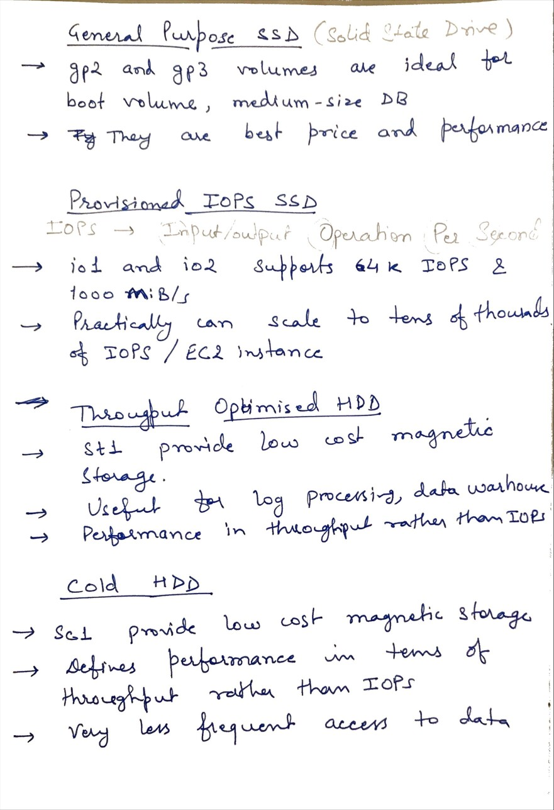

# Day 6 - Storage - EBS ( Elastic Block Store)

**Congrat, since you are here this means you have completed Day 5 and working on Day 6 **

## Hands on video

## Topic Covered
  - Types of Storage in AWS
  - EBS and its features
  - EBS Volume types and their use case

## My Notes

  ### AWS Storage and how it connect
  
  
  ### EBS and its features
  

  ### EBS volume types
  

