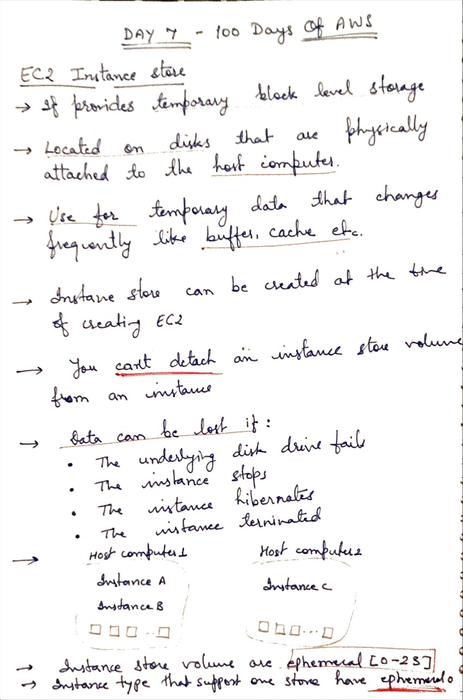
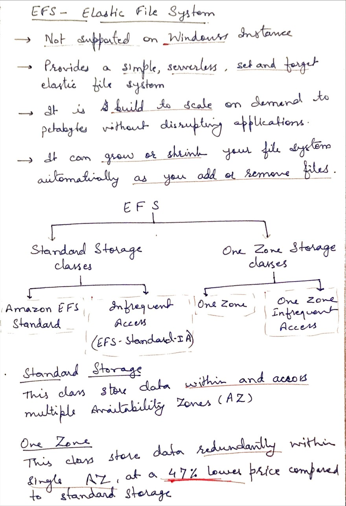

# Day 7 - Storage - EFS and Instance Store

**Congrat, since you are here this means you have completed Day 6 and working on Day 7**

## Hands on video

## Topic Covered
  - EC2 Instance Store
  - EFS ( Elastic File System)
  - Types of EFS

## My Notes

  ### EC2 Instance Store
  
  
  ### EFS ( Elastic File System)
  

