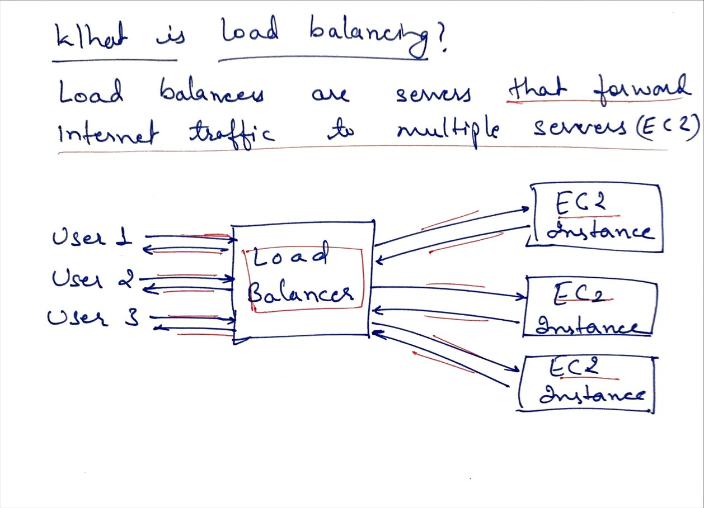
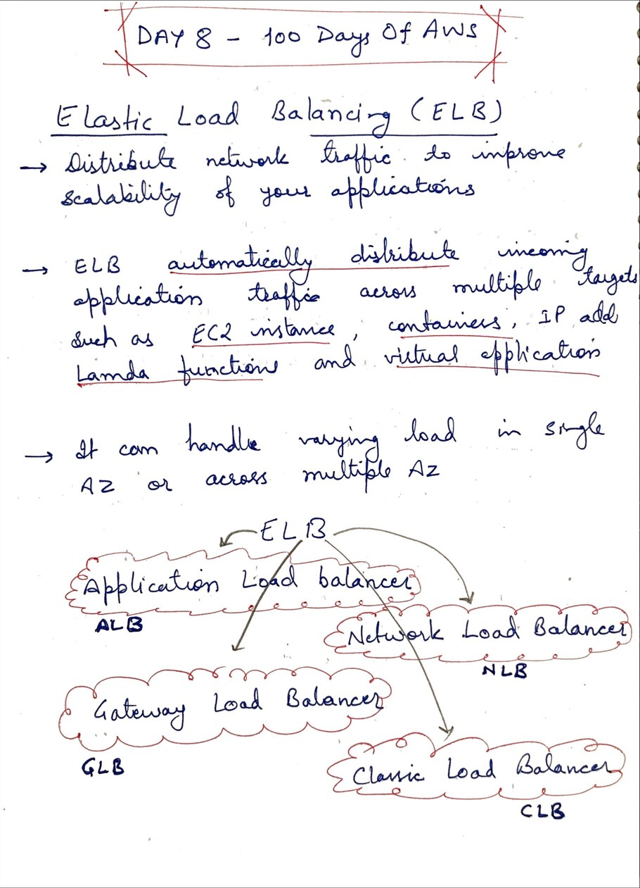
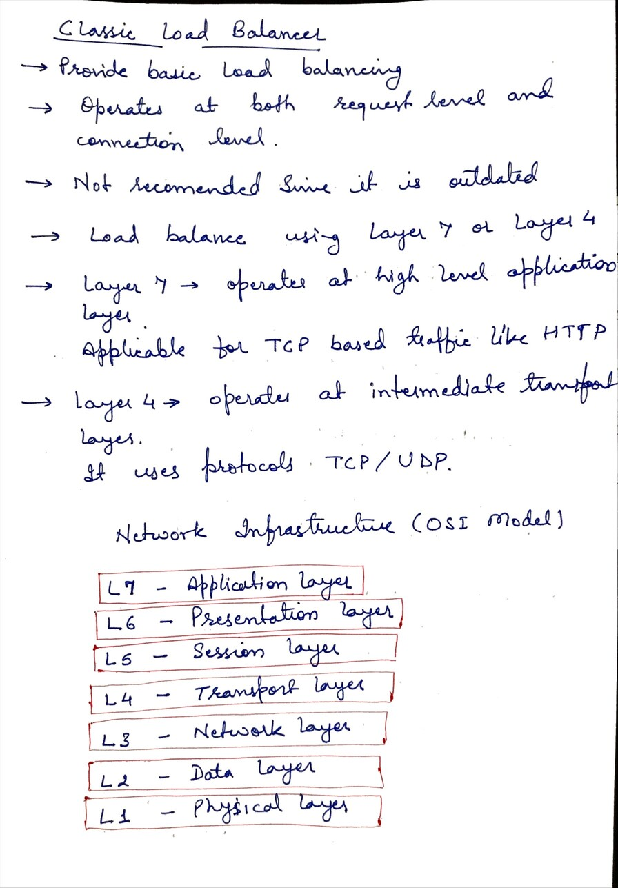
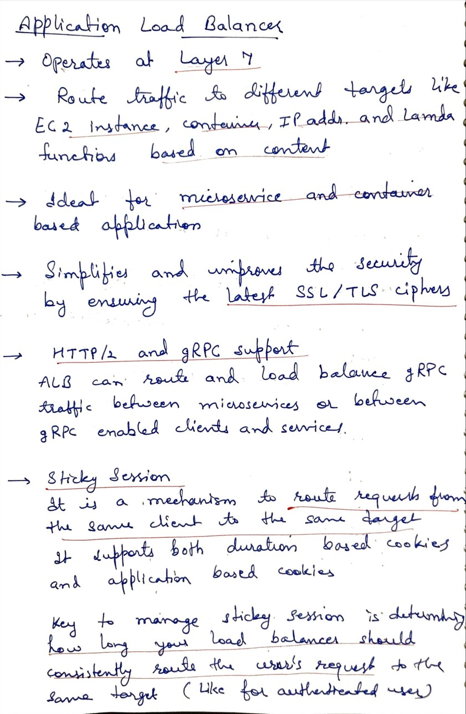

# Day 8 - Load Balancing - ELB ( Classic and Application)

**Congrat, since you are here this means you have completed Day 7 and working on Day 8**

## Hands on video

## Topic Covered
  - EC2 Instance Store
  - Elastic Load Balancing
  - Classic Load Balancer
  - Application Load Balancer

## My Notes

  ### What is Load balancer
  

  ### Elastic Load Balancing
  
  
  ### Classic Load Balancer
  
  
  ###  Application Load Balancer
  

