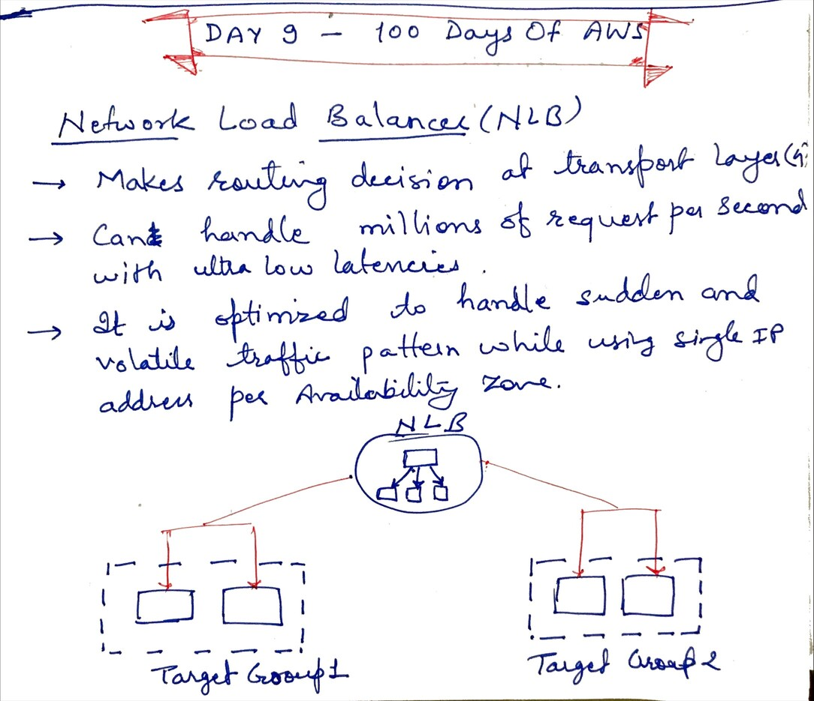
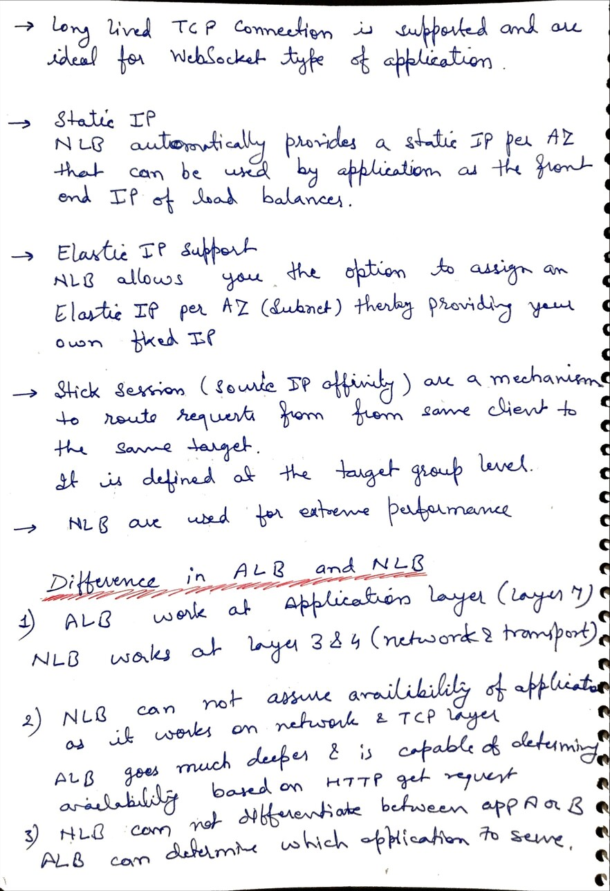
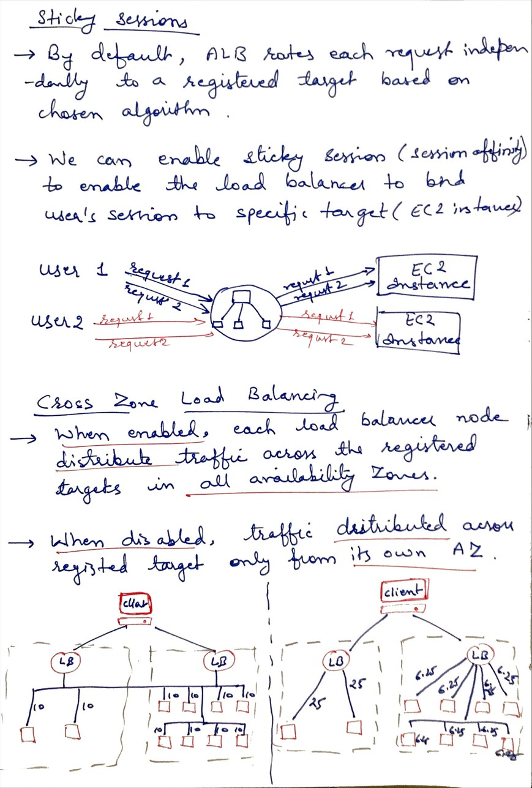

# Day 9 - Network Load Balancer, sticky session, cross zone balancing

**Congrat, since you are here this means you have completed Day 8 and working on Day 9**

## Hands on video

## Topic Covered
  - Network Load Balancer
  - Difference between Application Load Balancer and Network Load balancer
  - Sticky Session
  - Cross Zone Load Balancing

## My Notes

  ### Network Load balancer
  
  
  ### NLB vs ALB
  
  
  ### Sticky session and Cross Zone Load Balancing
  

