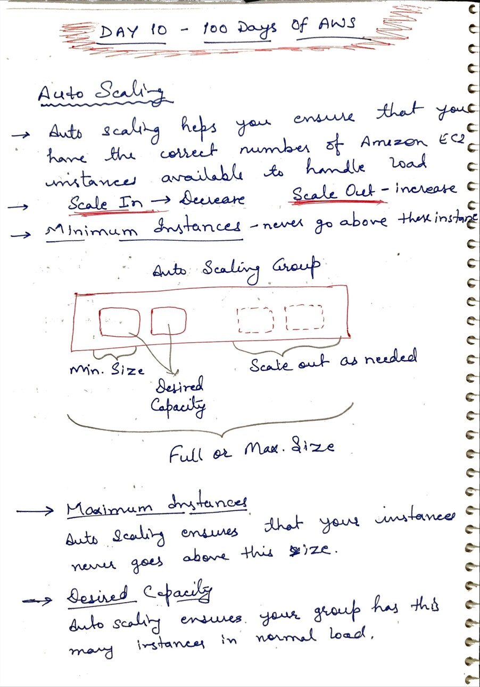
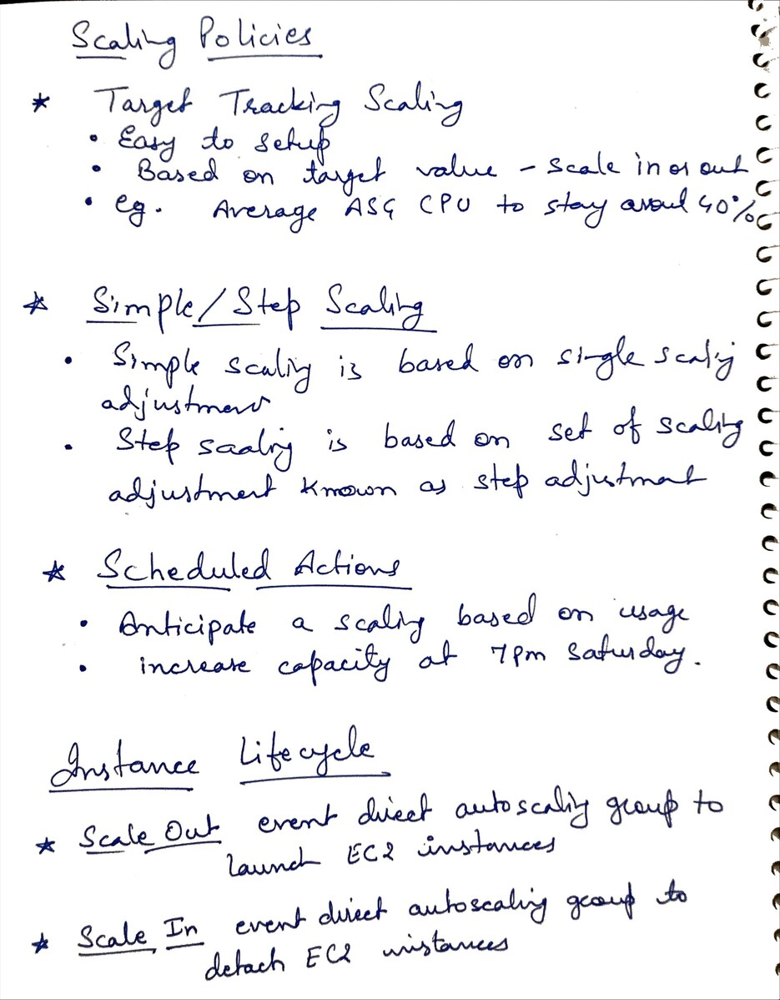

# Day 10 - Auto Scaling and Scaling Policies

**Congrat, since you are here this means you have completed Day 9 and working on Day 10**

## Hands on video

## Topic Covered
  - Auto Scaling Instance Lifecycle
  - What is Auto Scaling
  - Key components of Auto Scaling
  - Cloudwatch Alarm
  - Scaling Policy

## My Notes

  ### Auto Scaling Instance Lifecycle
  
  
  ### What is Auto Scaling
  
  
  ### Key components of Auto Scaling
  

  ### Cloudwatch Alarm
  
    
  ### Scaling Policy
  
