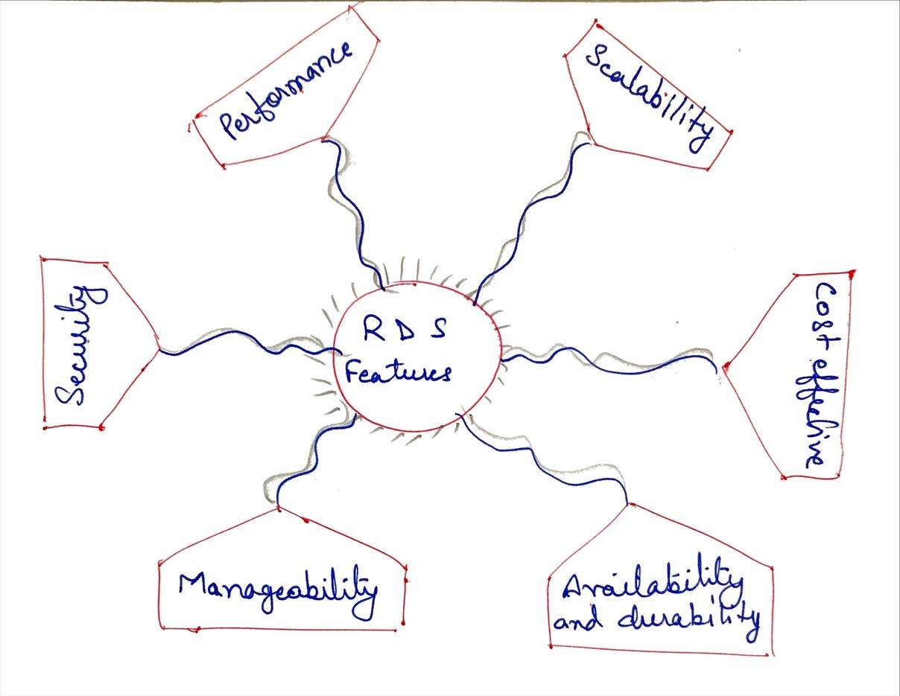
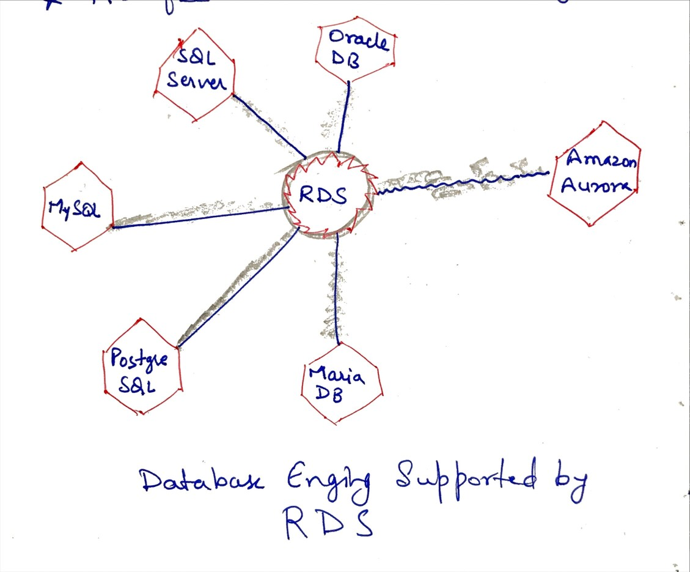
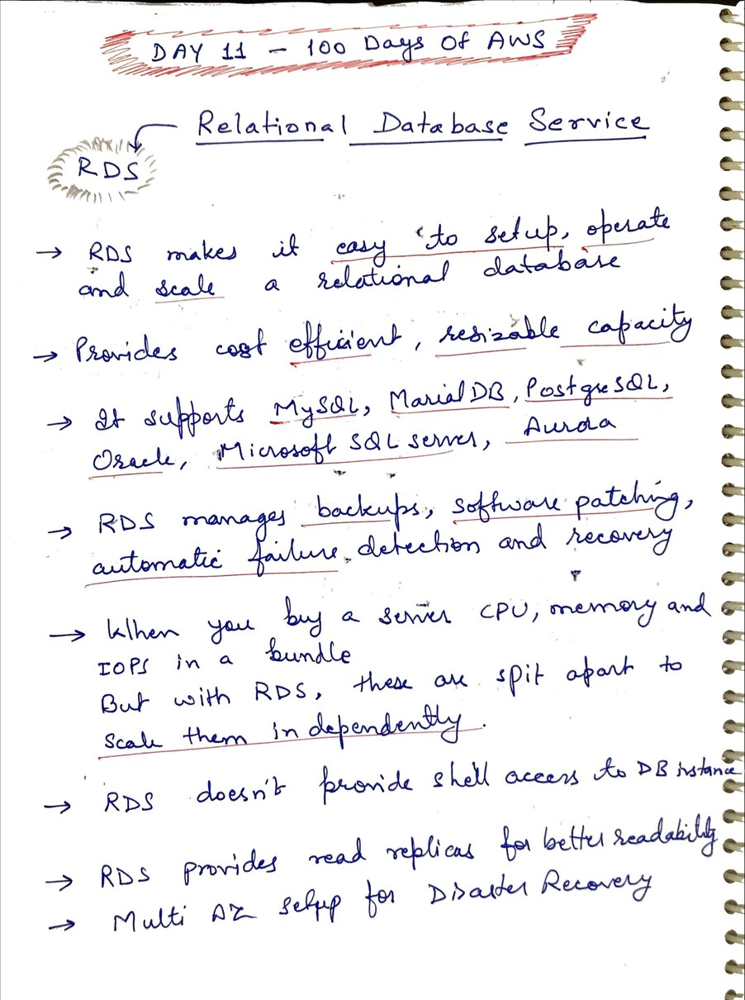
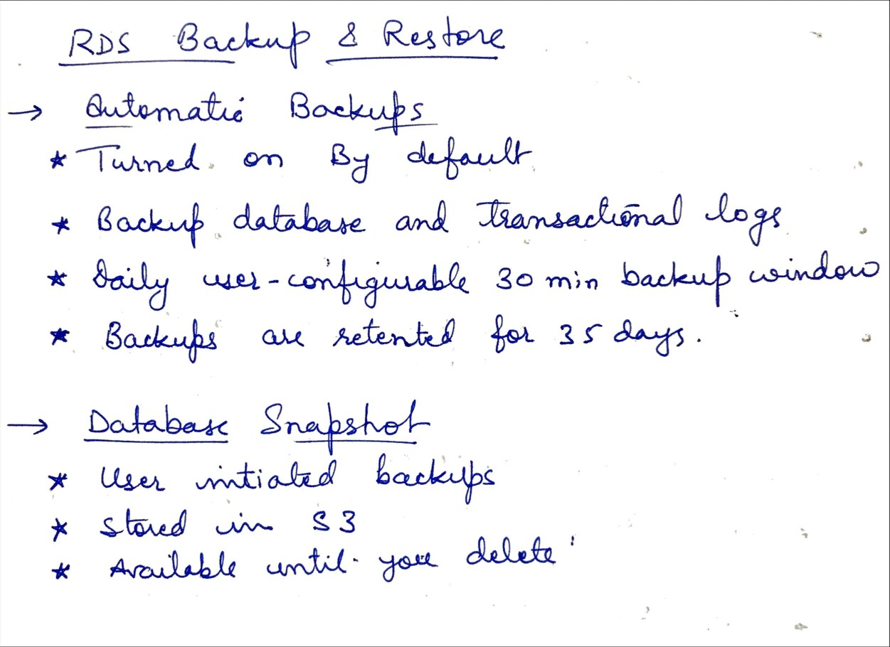
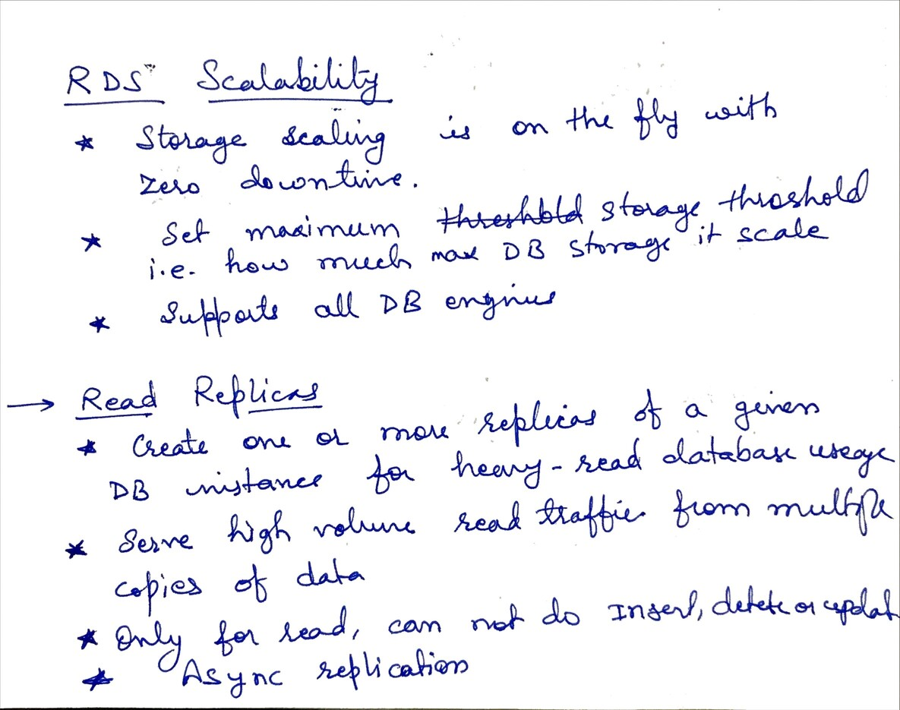
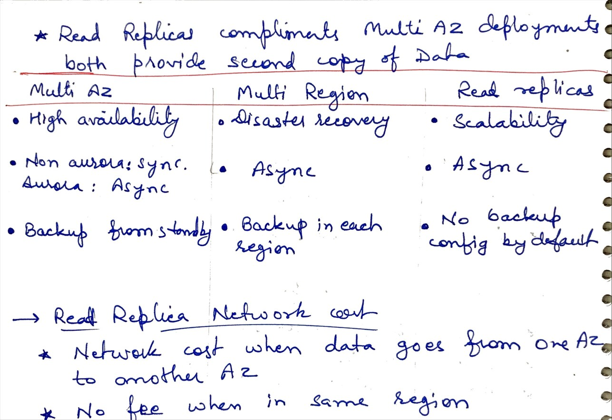

# Day 11 - Relational Database Service (RDS)

**Congrat, since you are here this means you have completed Day 10 and working on Day 11**

## Hands on video

## Topic Covered
  - What is RDS
  - RDS features
  - RDS Backup and Restore
  - Batabase Snapshot
  - RDS Scalability
  - Read Replicas
  - Replica Network Costs

## My Notes

  ### RDS Features
    

  ### RDS Database engine supports
  

  ### Relational Datbase Service
  
  
  ### Backup and Restore,and Snapshots
  
  
  ### Read Replicas
  
  
  ### Replica Network costs, Multi AZ comparision
  
  
  
  
