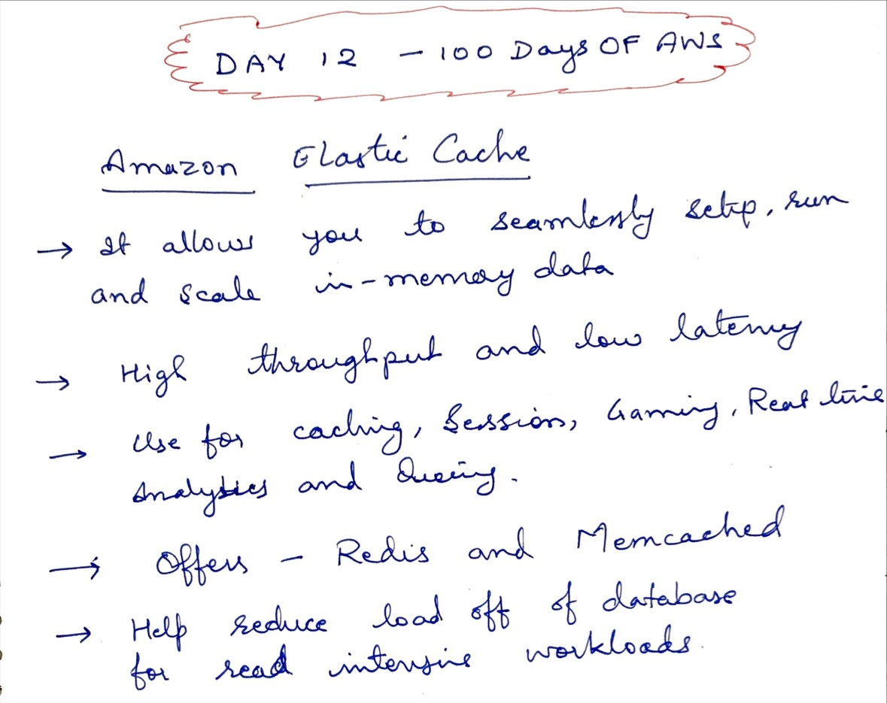
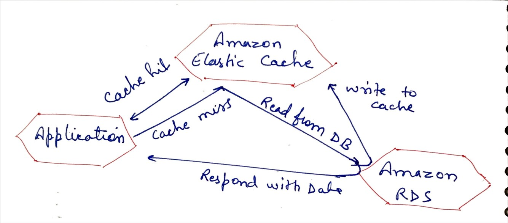
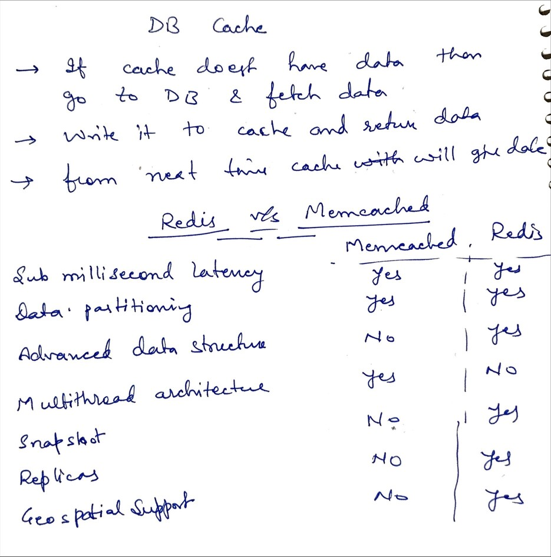
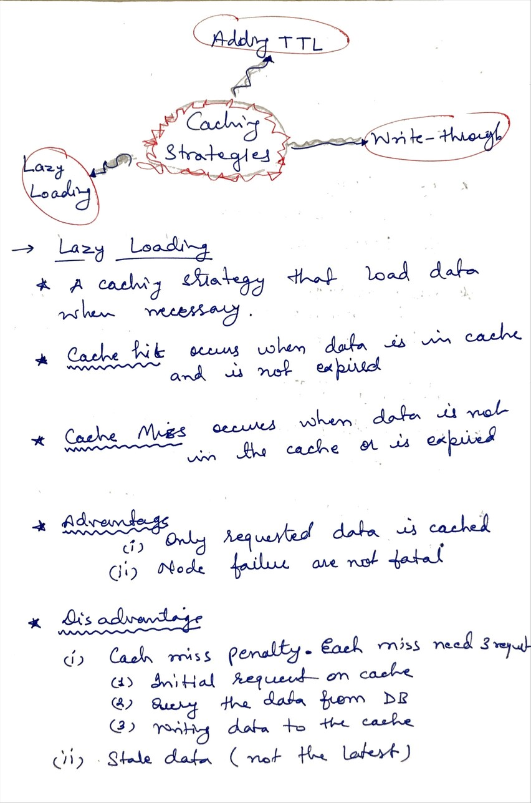
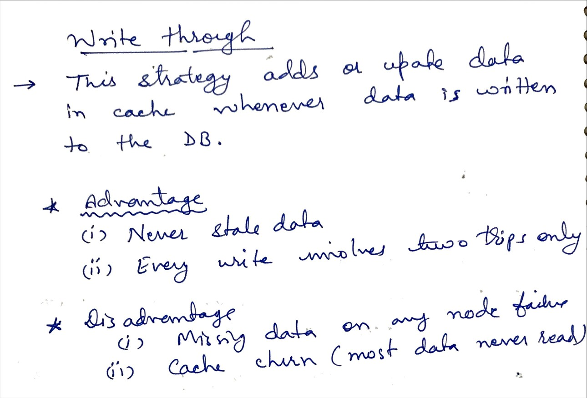
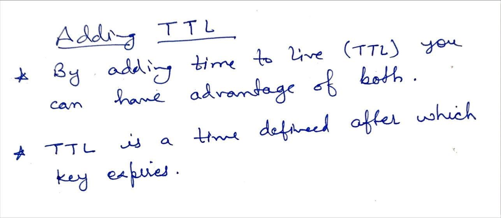

# Day 12 - Elastic Cache - Redis and Memcahced

**Congrat, since you are here this means you have completed Day 11 and working on Day 12**

## Hands on video

## Topic Covered
  - Amazon Elastic Cache
  - How caching works
  - Redis vs Memcached
  - Caching Strategies
  - Lazy Caching Stratery
  - Write through strategy
  - Adding TTL strategy

## My Notes

  ### Amazon Elastic Cache
  

  ### How caching works
  
  
  ### Redis vs Memcached
  
    
  ### Caching Strategy
  

  ### Write Through Caching Strategy
  

  ### Adding TTL Caching Strategy
  

