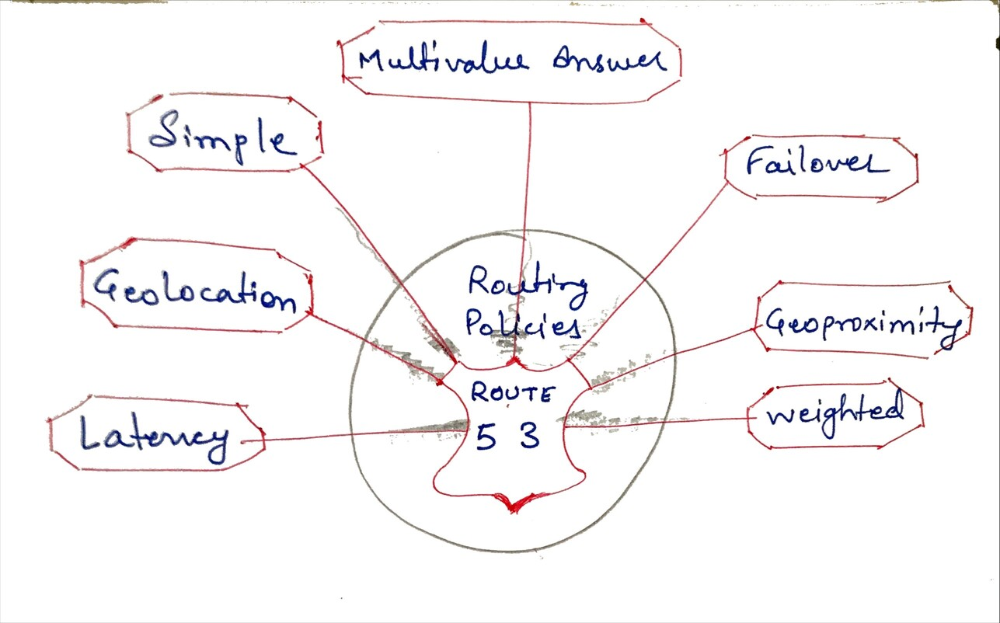
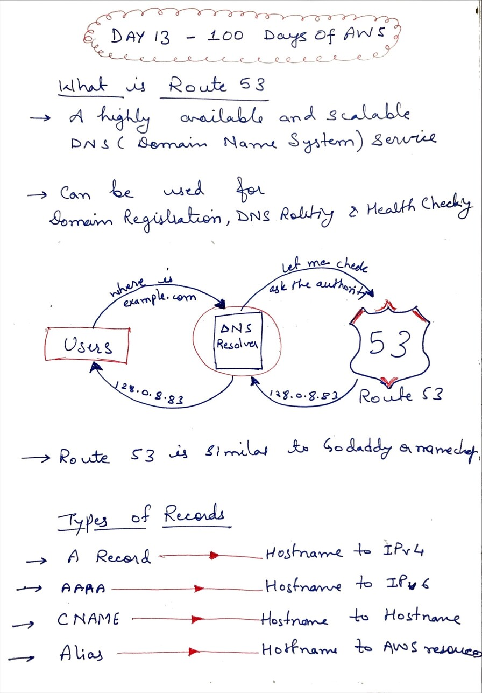
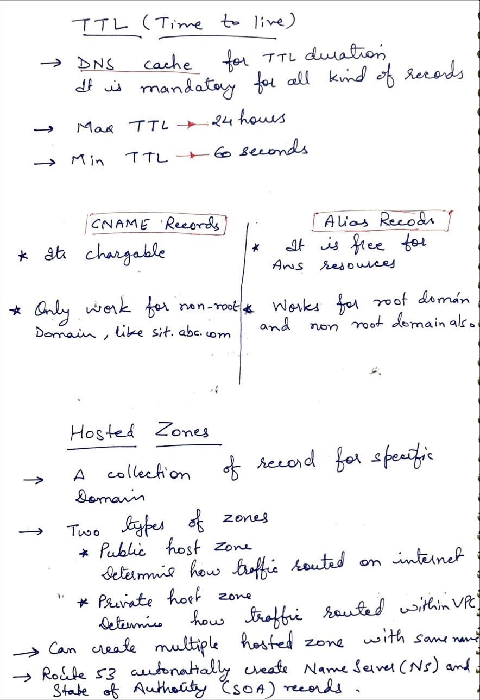

# Day 13 - Route 53

**Congrat, since you are here this means you have completed Day 12 and working on Day 13**

## Hands on video

## Topic Covered
  - What is Route 53
  - Route 53 Routing Policies
  - TTL
  - Difference in CNAME and Alias
## My Notes

  ### Route 53 Policies
  
  
  ### What is Route 53
  
  
  ### TTL and Difference in CNAME and Alias
  
  
