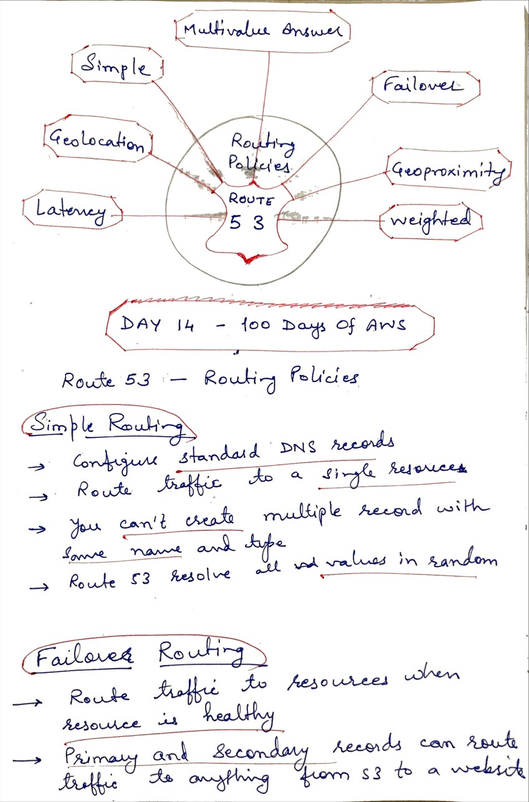
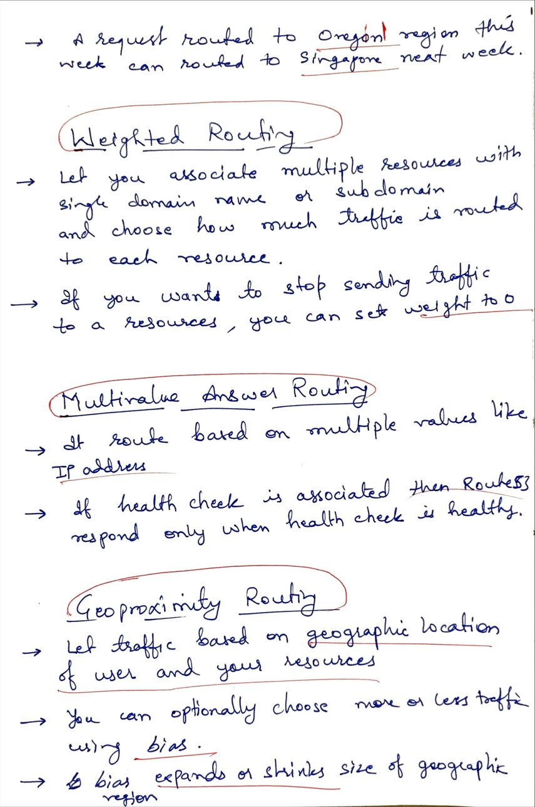

# Day 14 - Routing Policies

**Congrat, since you are here this means you have completed Day 13 and working on Day 14**

## Hands on video

## Topic Covered
  - Simple routing policy
  - Failover routing policy 
  - Geolocation routing policy 
  - Geoproximity routing policy
  - Latency routing policy
  - Multivalue answer routing policy
  - Weighted routing policy

## My Notes

  ### Simple and Failover Routing
  
  
  ### Geolocation, and Latency based Routing
  
  
  ### Weighted, Multivalue answer and Geoproximity Routing
  
  

  
