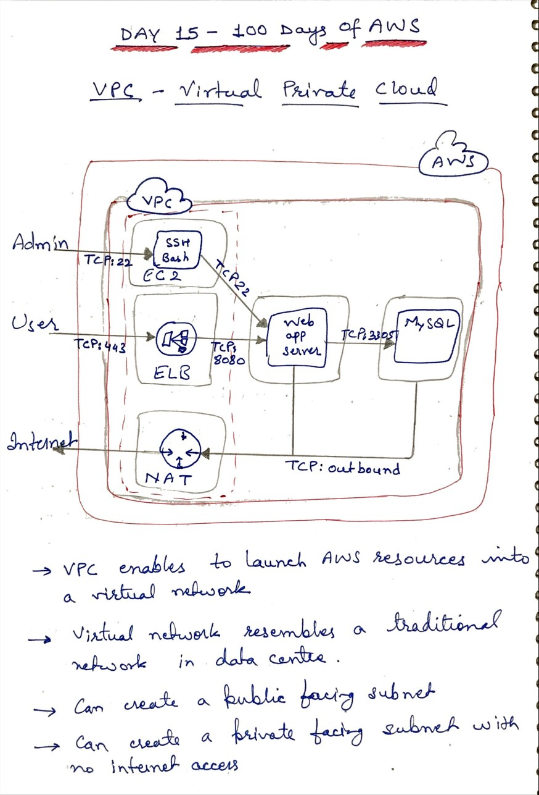
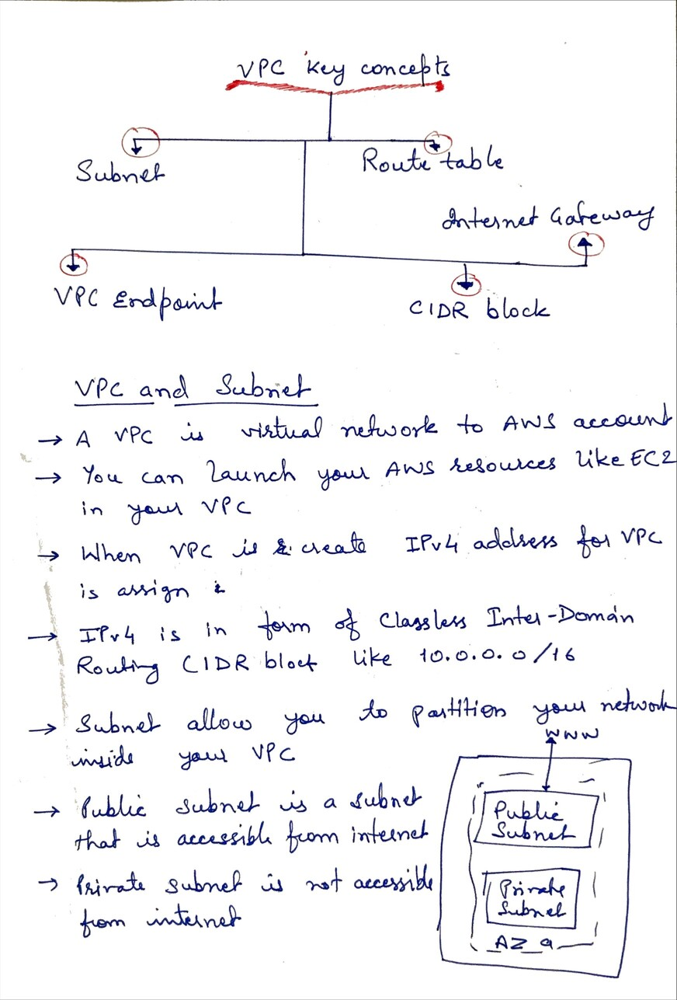
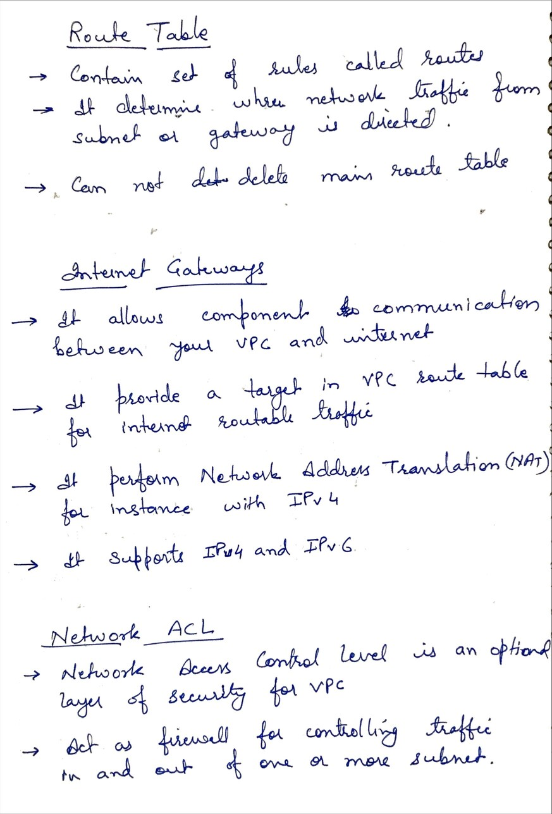
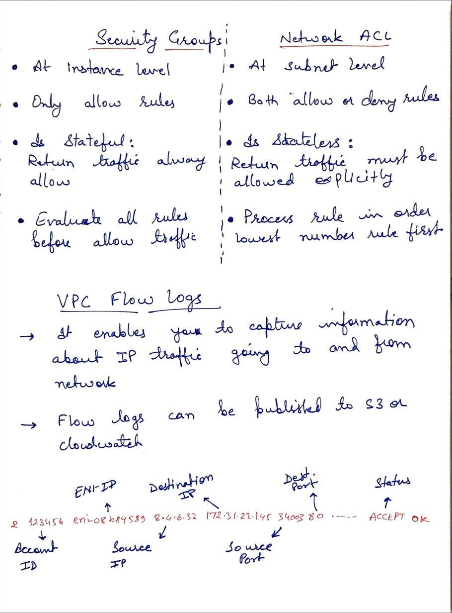

# Day 15 - Virtual Private Cloud

**Congrat, since you are here this means you have completed Day 14 and working on Day 15**

## Hands on video

## Topic Covered
  - What is VPC
  - VPC and Subnet
  - Route Table
  - Internet Gateway
  - Network ACL
  - Security Group vs Network ACL
  - Flow Log

## My Notes

  ### What is VPC and what it includes
  
  
  ### VPC and Subnet
  
  
  ### Route Table, Internet Gateway and Network ACL
  
  
  ### Security Group vs Network ACL and Flow Log
  
  
  

  
