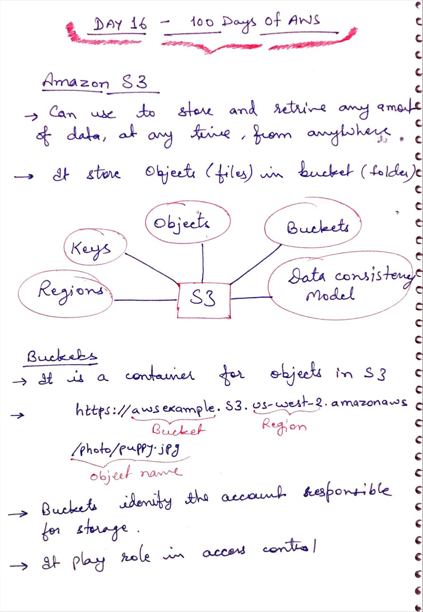
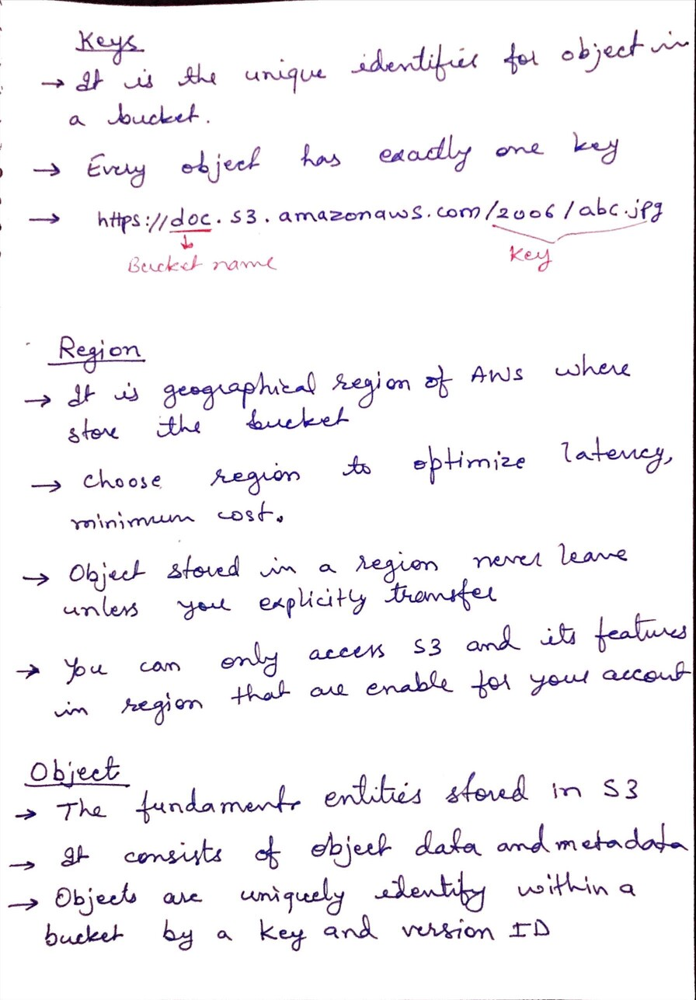
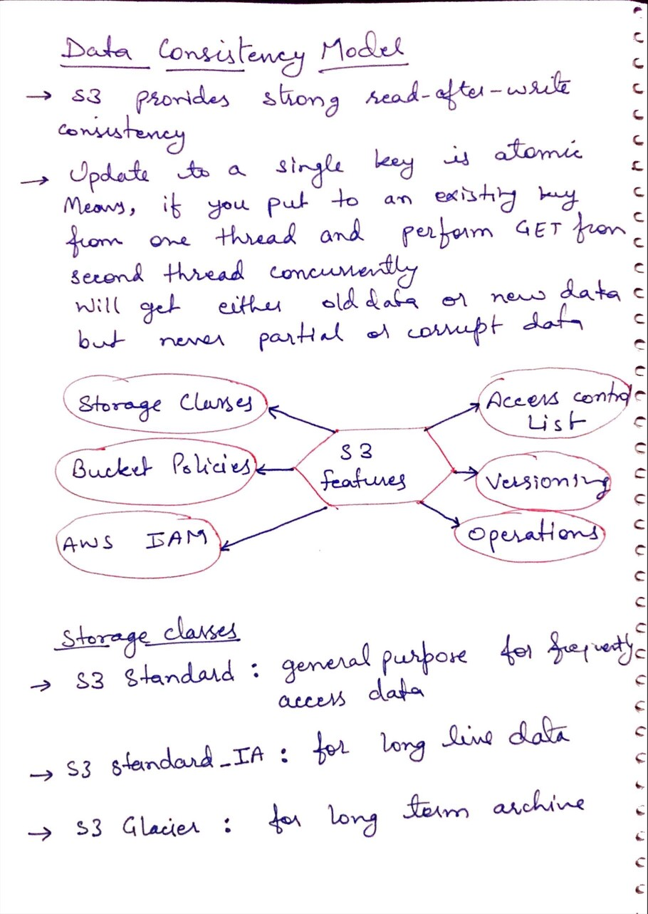
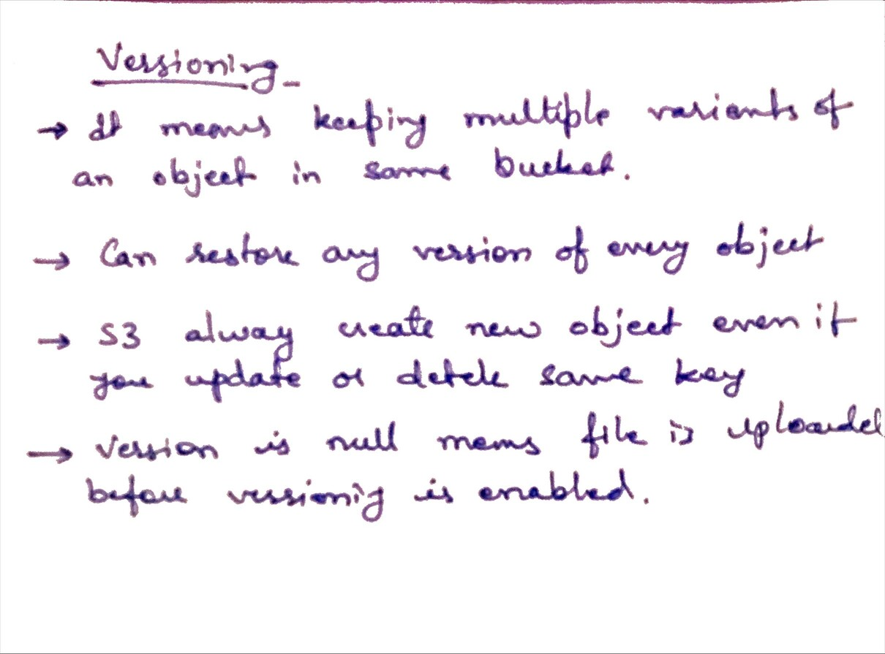

# Day 16 - Amazon S3 Bucket

**Congrat, since you are here this means you have completed Day 15 and working on Day 16**

## Hands on video

## Topic Covered
  - Amazon S3 and its concepts
    - Region
    - Keys
    - Objects
    - Bucket
    - Data Consistency model
  - Amazon S3 features
    - Storage Classes
    - Versioning

## My Notes

  ### Amazong S3 and its concepts
  

  ### Keys, Regions, and Objects
  

  ### Data consistency and Storage Classes
  
  
  ### Versioning
  
