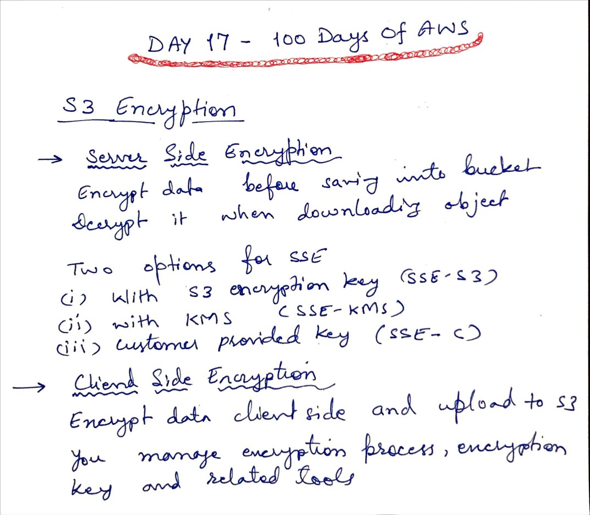
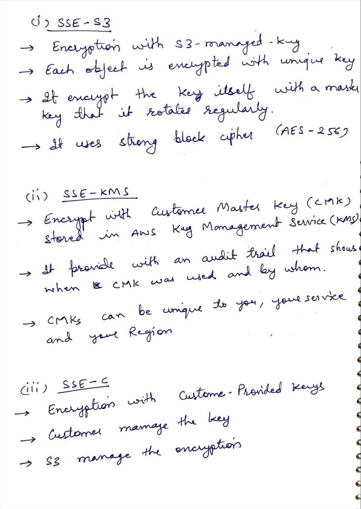
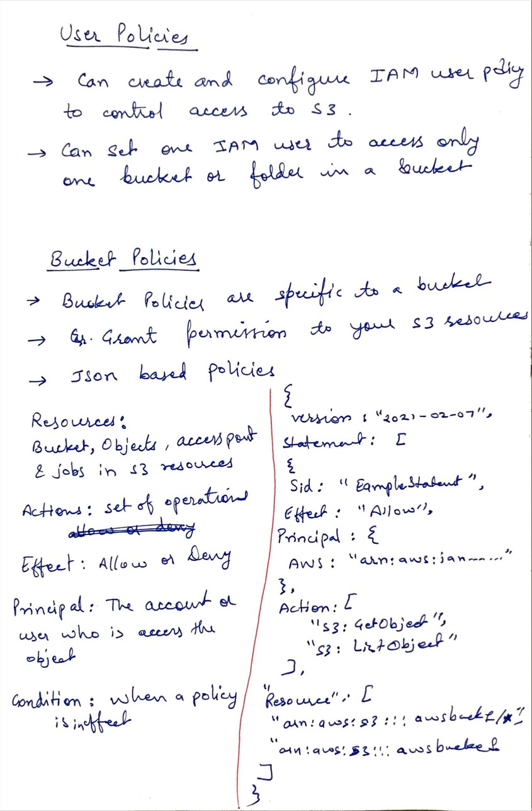

# Day 17 - Amazon S3 Encryption and Policies

**Congrat, since you are here this means you have completed Day 16 and working on Day 17**

## Hands on video

## Topic Covered
  - S3 Encryption
  - SSE S3
  - SSE KMS
  - SSE C
  - User Policies
  - Bucket Policies

## My Notes

  ### S3 Encryption
  
  
  ### Server Side Encryption
  

  ### User Policy and Bucket Policy
  
