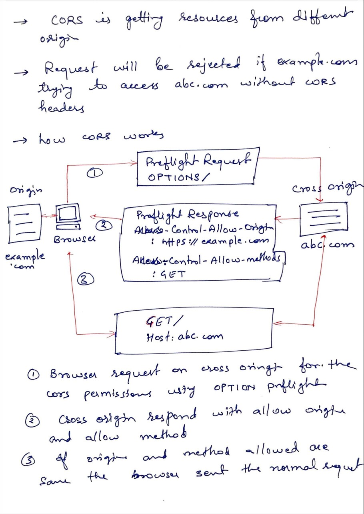
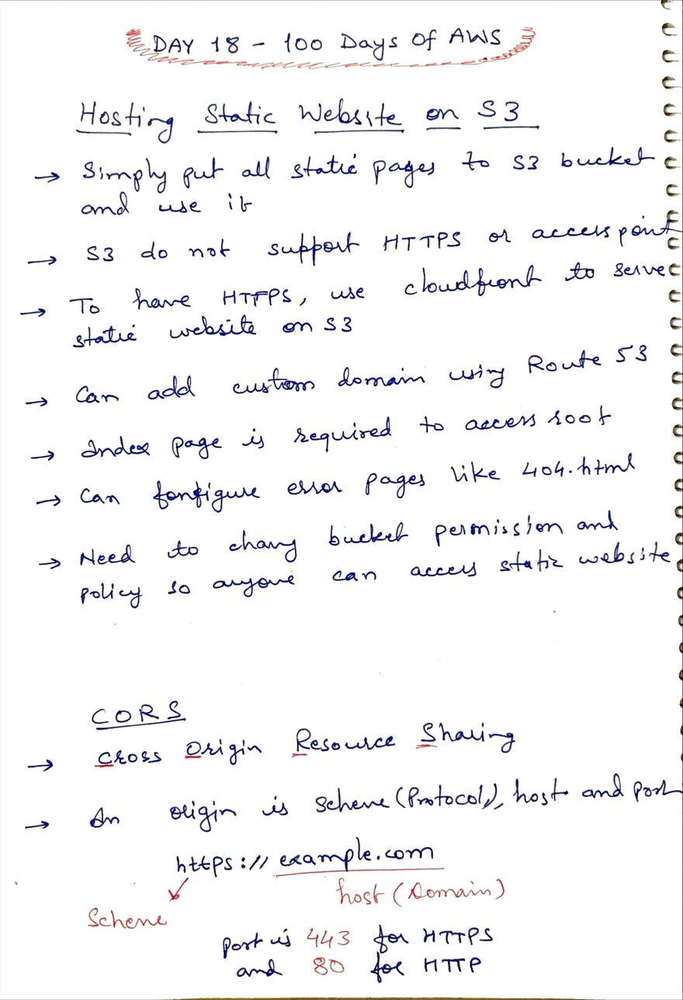

# Day 18 - Amazon S3 Static Website Hosting and CORS

**Congrat, since you are here this means you have completed Day 17 and working on Day 18**

## Hands on video

## Topic Covered
  - Hosting Static website on S3
  - What is CORS and how it works

## My Notes

  ### Hosting Static Website on S3
  

  ### What is CORS and how it works
  
