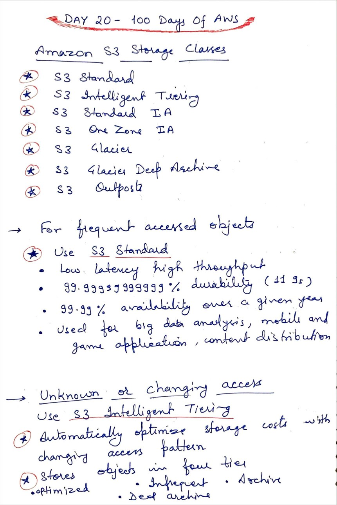
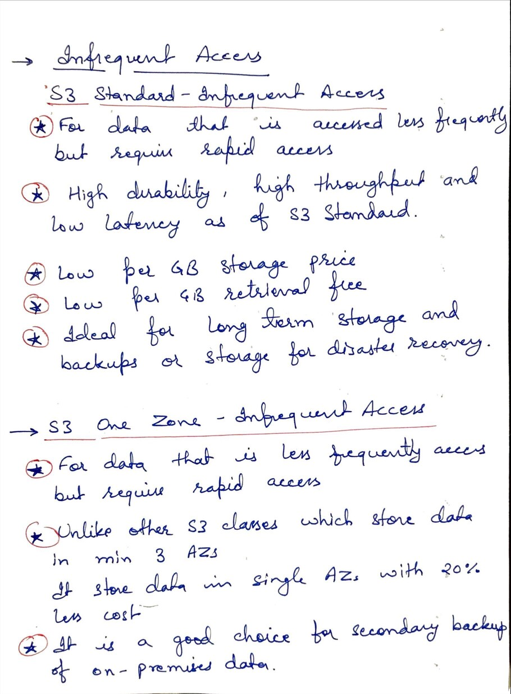
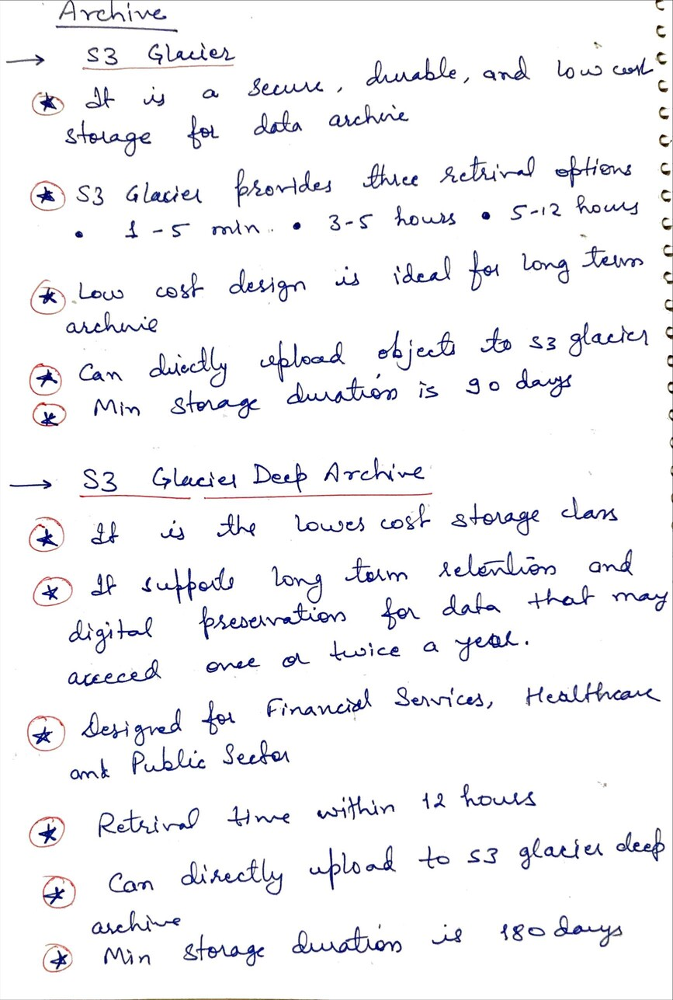

# Day 20 - Amazon S3 - Conitnued...

**Congrat, since you are here this means you have completed Day 19 and working on Day 20**

## Hands on video

## Topic Covered
 - Storage Classes in Amazon S3

## My Notes

  ### S3 Storage Classes, S3 standard and S3 Intelligent Tiering
  

  ### S3 Standard-IA and S3 One Zone-IA
  

  ### S3 Glacier and S3 Glacier Deep Archive
  

  
