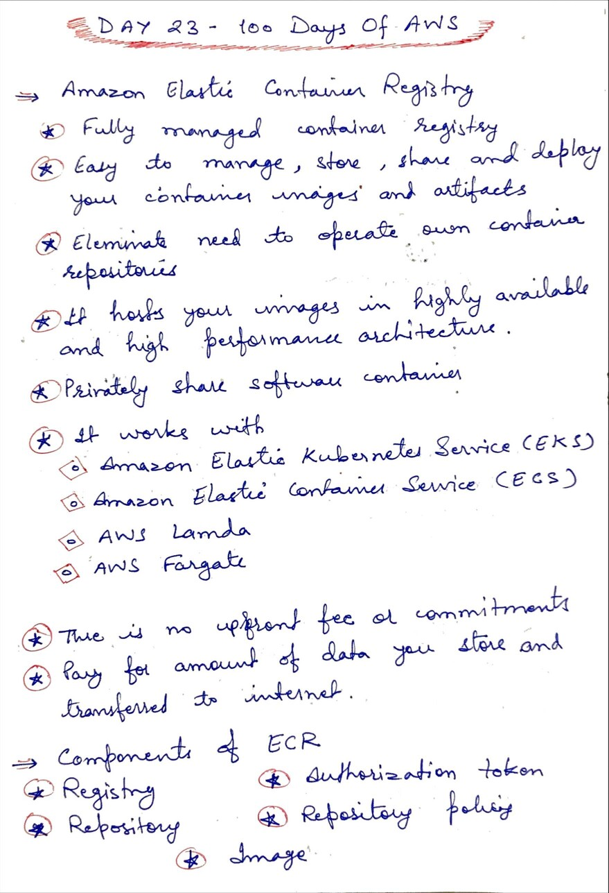
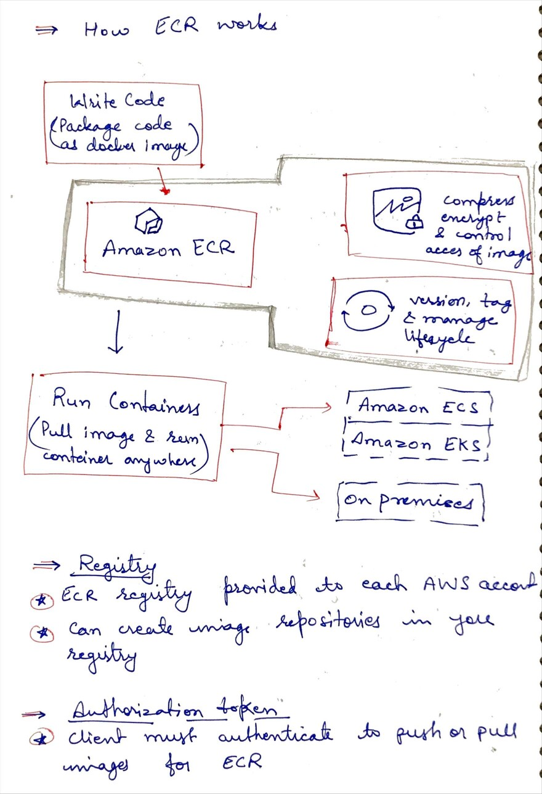
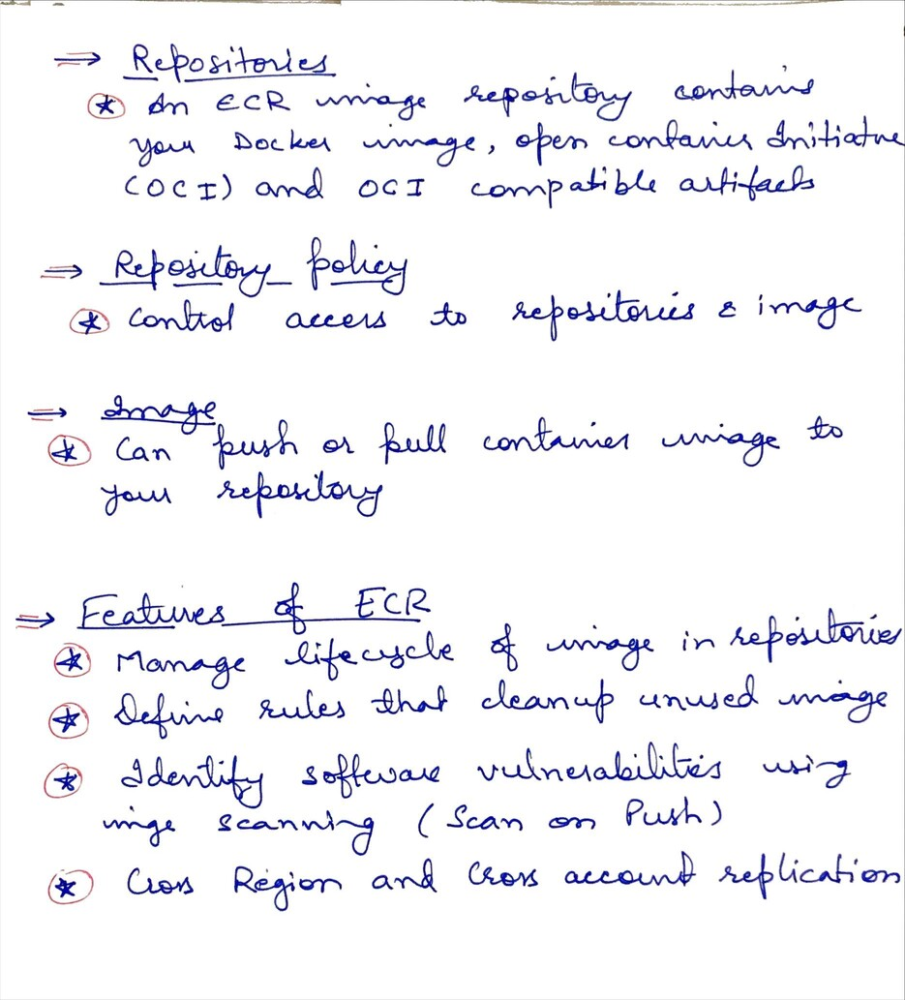

# Day 23 - Amazon Elastic Container Registry

**Congrat, since you are here this means you have completed Day 22 and working on Day 23**

## Hands on video

## Topic Covered
 - What is Amazon ECR
 - How ECR works
 - ECR components
 - Features of ECR

## My Notes

  ### What is ECR
  

  ### How ECR works
  
  
  ### Features of ECR
  

  
