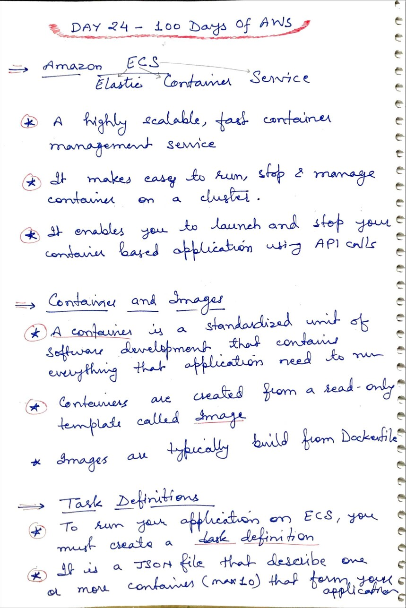
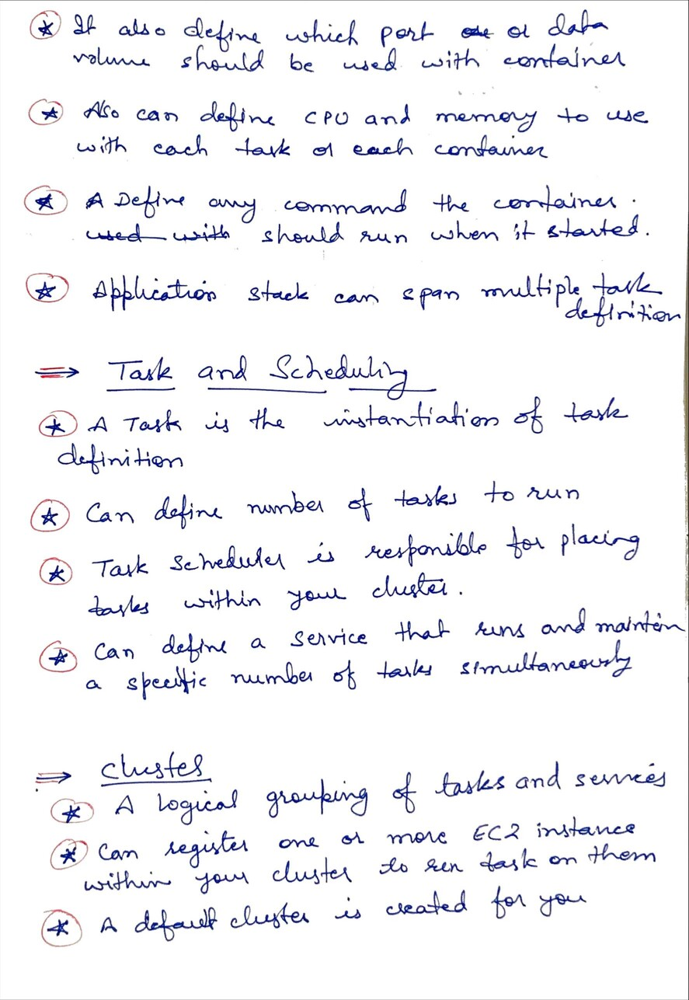
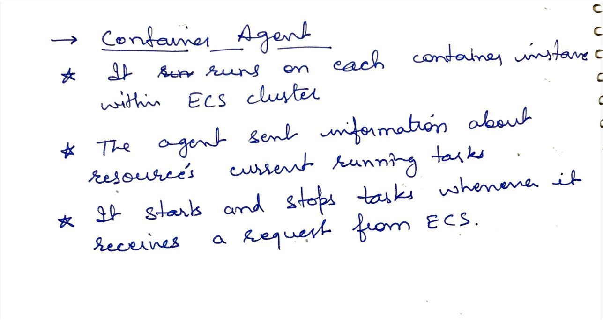

# Day 24 - Amazon Elastic Container Service

**Congrat, since you are here this means you have completed Day 23 and working on Day 24**

## Hands on video

## Topic Covered
 - What is Amazon ECS
 - Container agent
 - container & Image
 - Task Scheduling & Cluster

## My Notes

  ### What is ECS, container and Image
  
  
  ### Task Scheduling and Cluster
  
  
  ### Container agent
  
