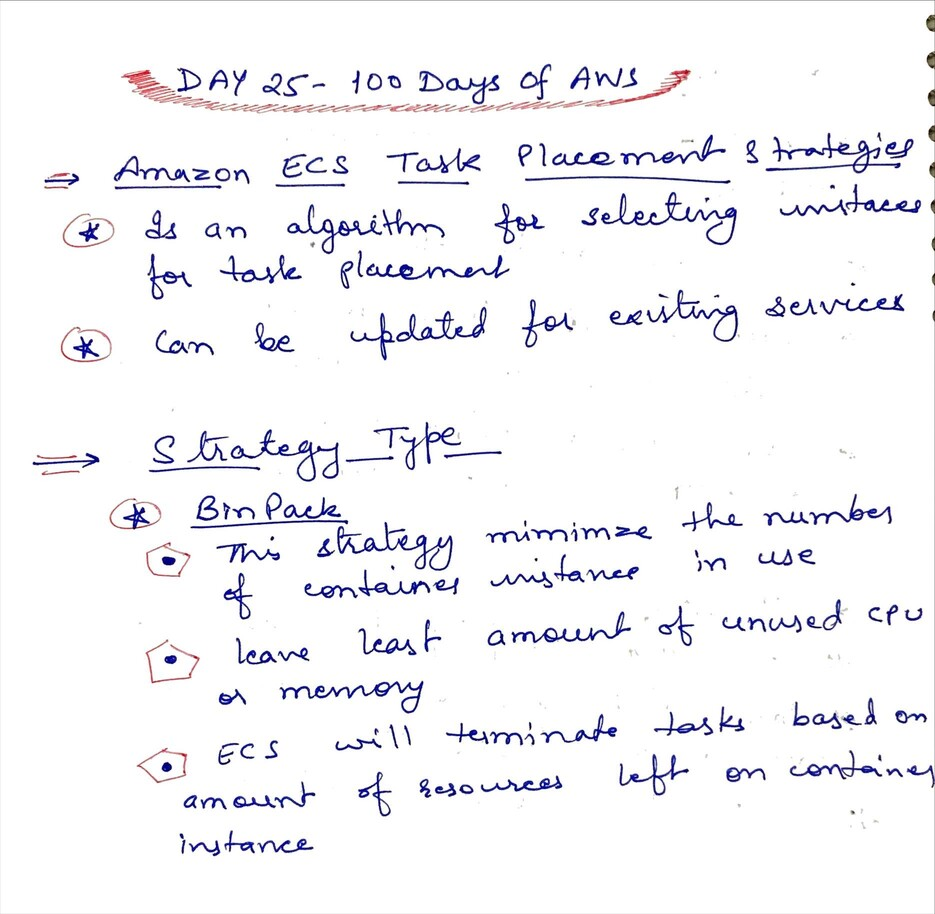
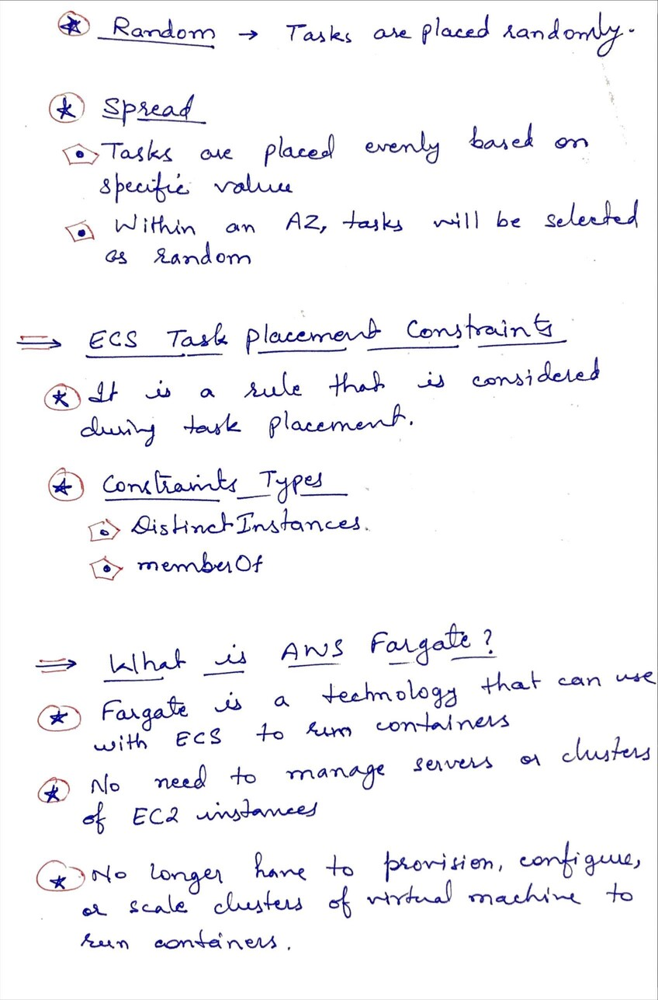
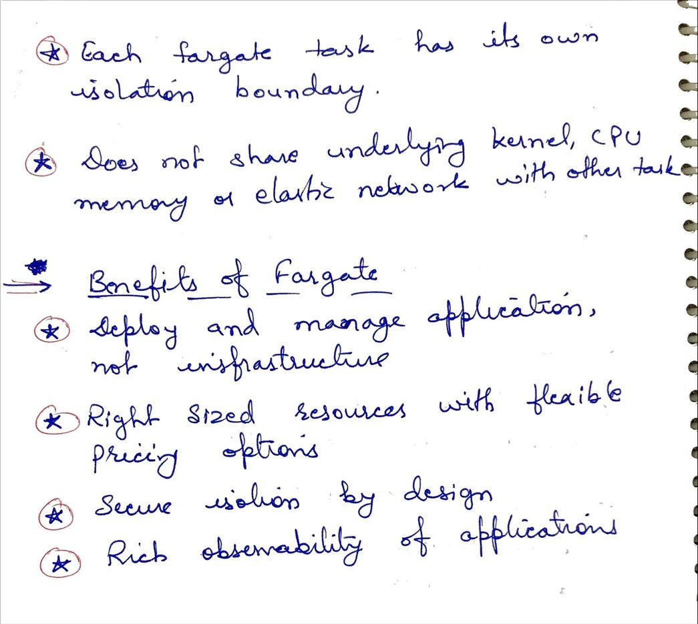

# Day 25 Amazon Elastic Container Service - Fargate

**Congrat, since you are here this means you have completed Day 24 and working on Day 25**

## Hands on video

## Topic Covered
 - Task Placement strategies
 - What is AWS Fargate
 - Benefits of Fargate

## My Notes

  ### Task Placement strategies
  
  
  ### What is AWS Fargate
  
  
  ### Benefits of Fargate
  

  
