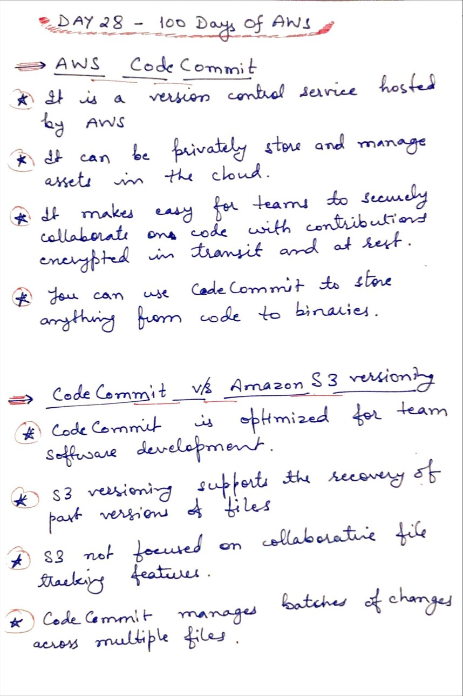
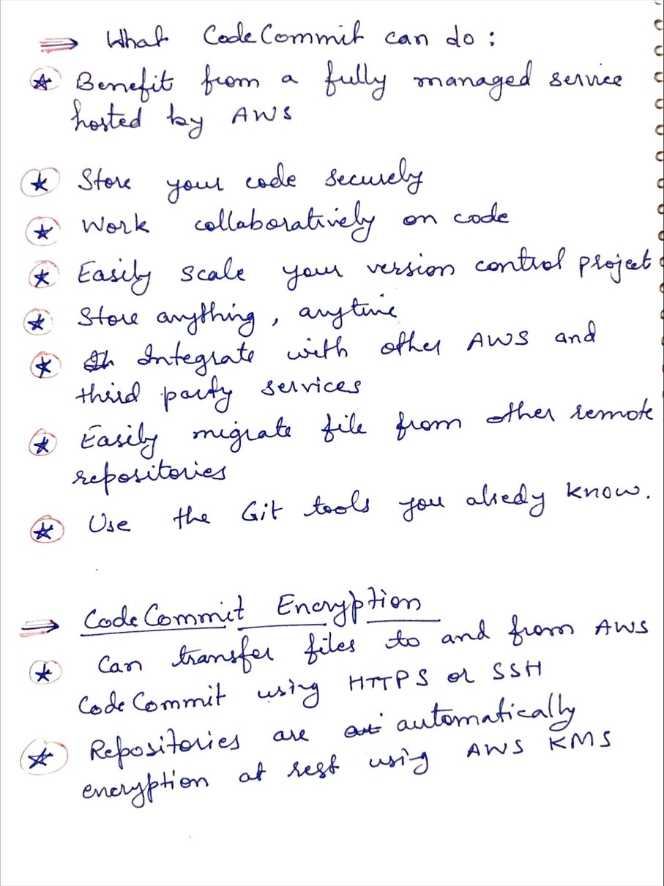

# Day 28 AWS Code Commit

**Congrat, since you are here this means you have completed Day 27 and working on Day 28**

## Hands on video

## Topics
  - What is AWS Code Commit
  - Code Commit v/s Amazon S3 versioning
  - What Code Commit can do
  - Code Commit Encryption
  - 
## My Notes
  
  
