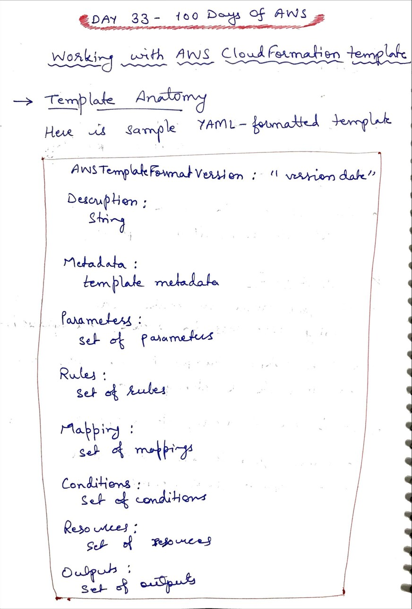
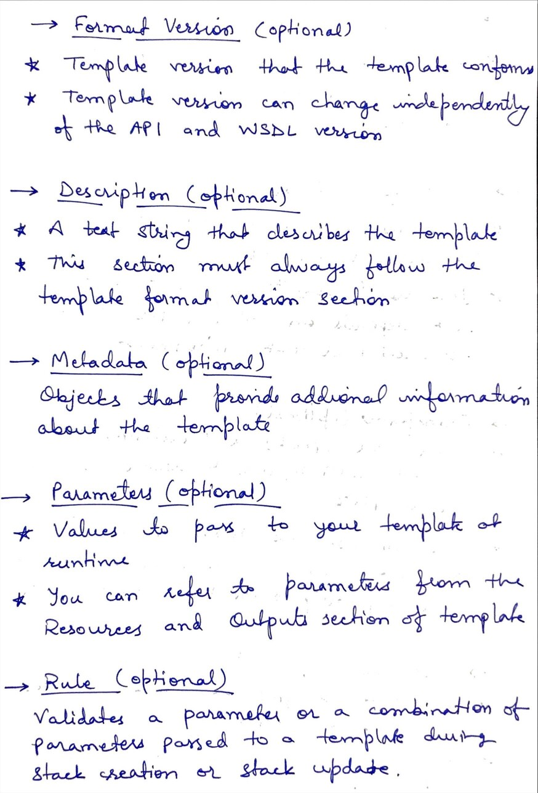
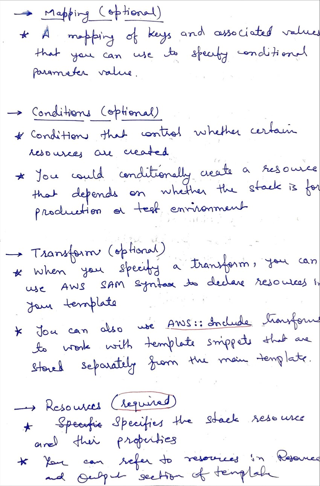
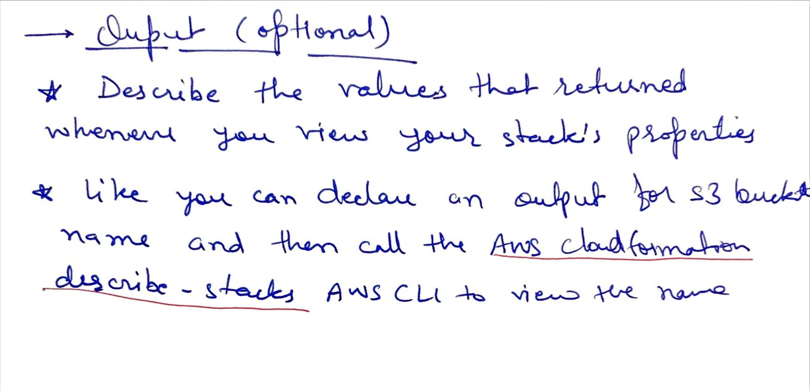

# Day 33 AWS Cloud Formation contin.

**Congrat, since you are here this means you have completed Day 32 and working on Day 33**

## Hands on video

## Topics
  - Template Anatomy
  - Template Parameters
  - Template resources and etc.

## My Notes
  
  
  
  

