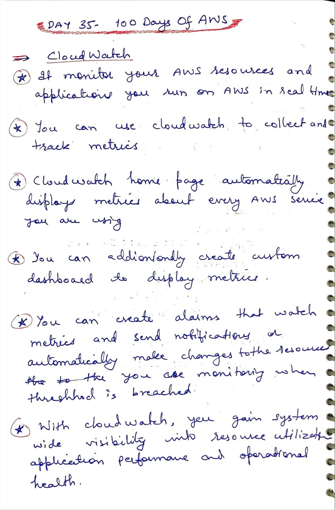
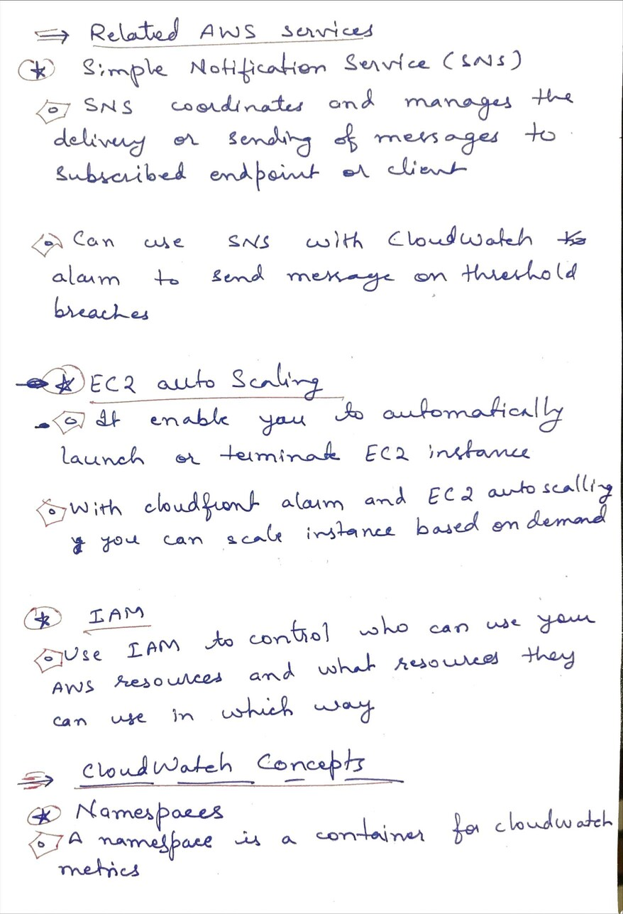
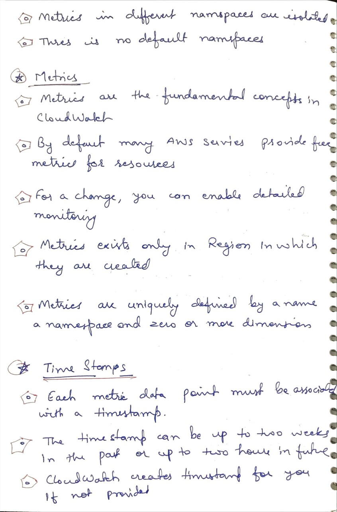
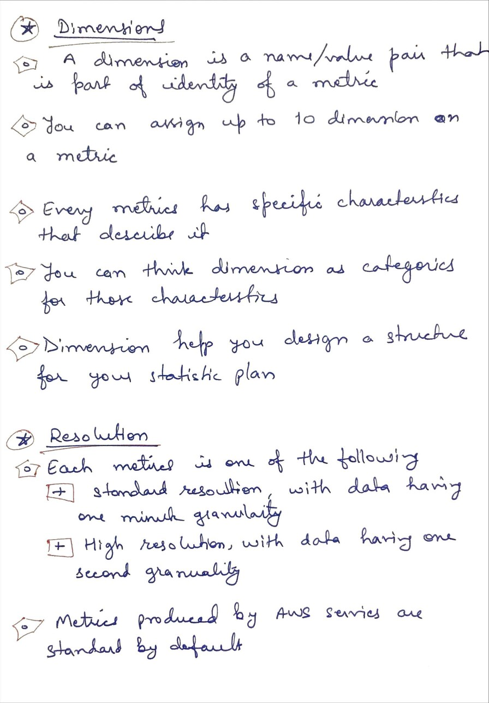

# Day 35 AWS CloudWatch

**Congrat, since you are here this means you have completed Day 34 and working on Day 35**

## Hands on video

## Topics
  - What is cloud watch
  - Related AWS Services
  - CloudWatch concepts

## My Notes
  
  
  
  

