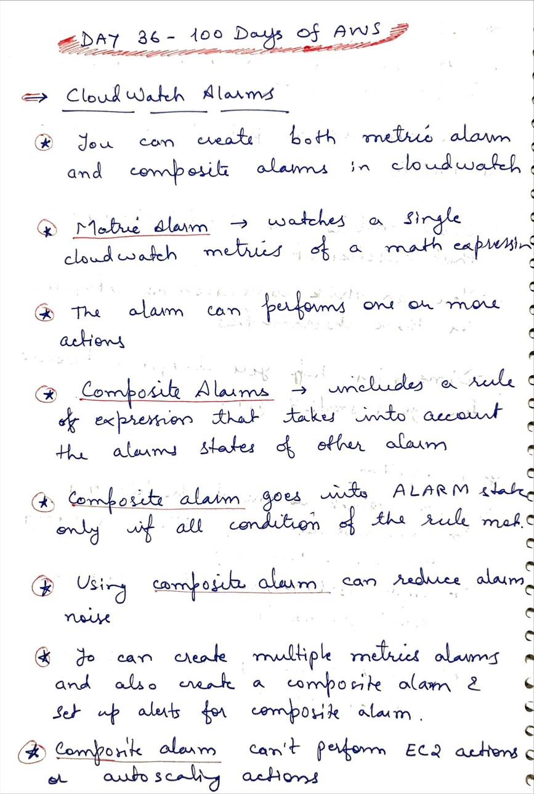
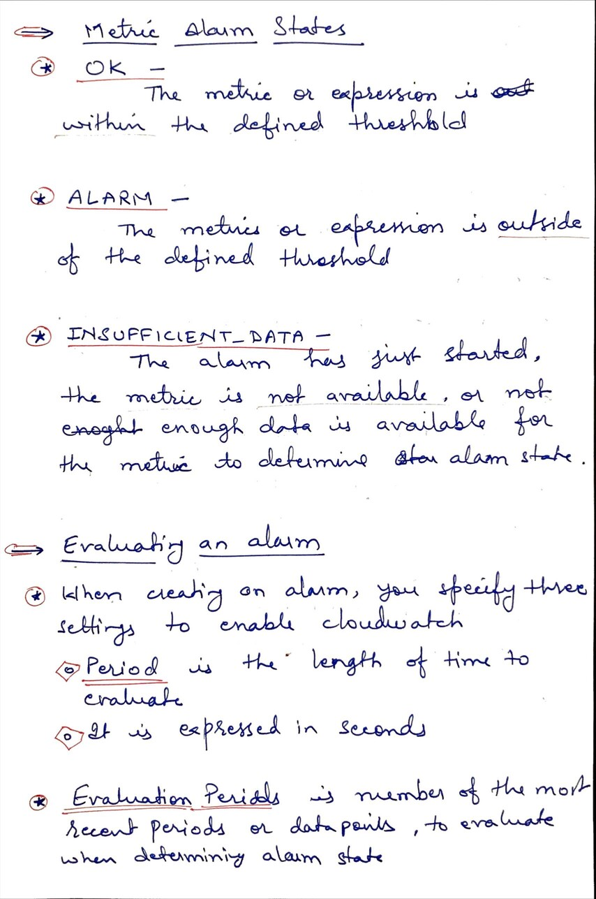
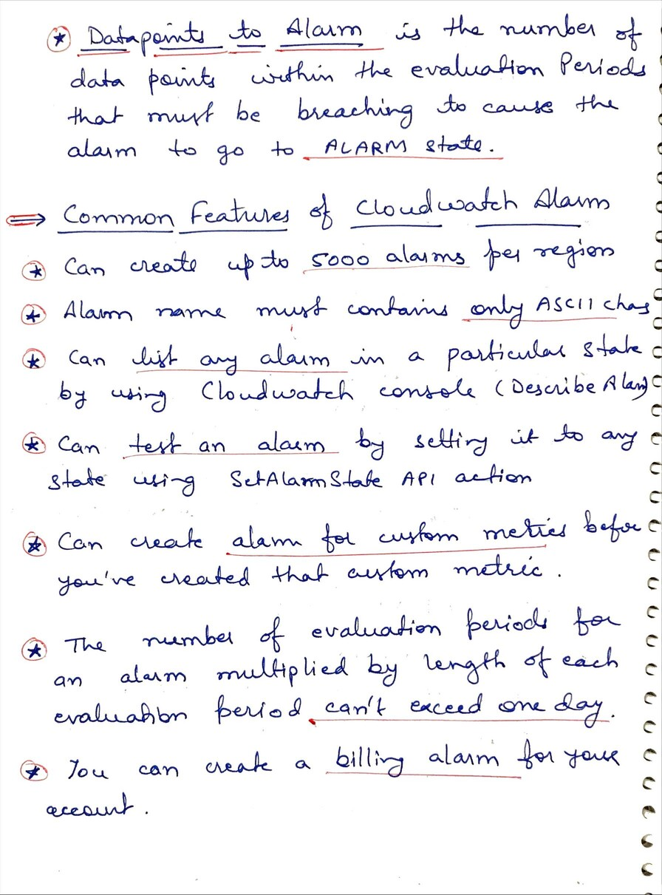

# Day 36 AWS CloudWatch Alarm

**Congrat, since you are here this means you have completed Day 35 and working on Day 36**

## Hands on video

## Topics
  - CloudWatch Alarms
  - Metrics Alarm States
  - Evaluating An Alarm
  - Common Features o Cloudwatch Alarm

## My Notes
  
  
  

