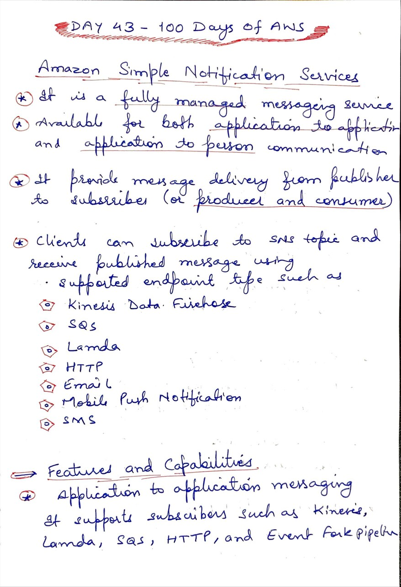
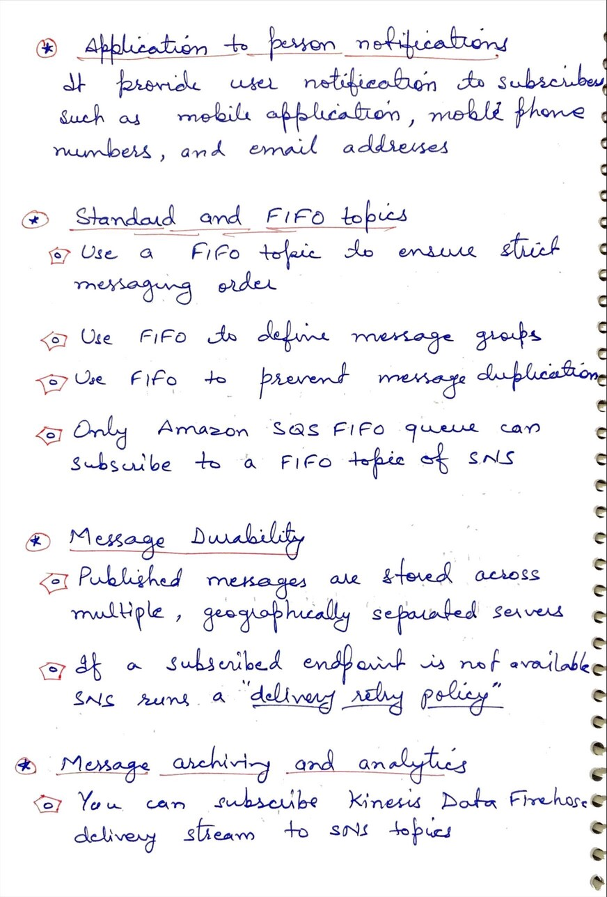
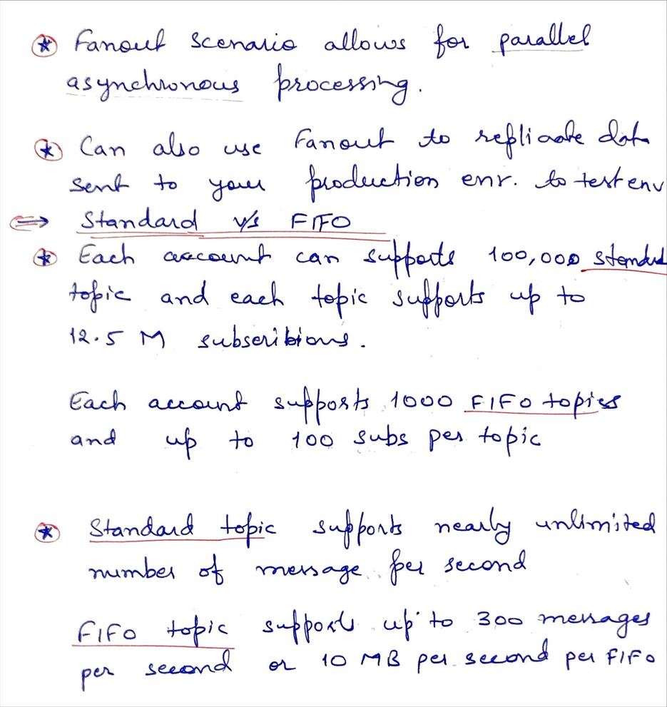

# Day 43 AWS Simple Notification Service (SNS)

**Congrat, since you are here this means you have completed Day 42 and working on Day 43**

## Hands on video

## Topics
  - What is SNS
  - SNS features and capabilities
  - Fanout Scenario
  - Standard topic vs FIFO topic in SNS
## My Notes
  
  
  
  
