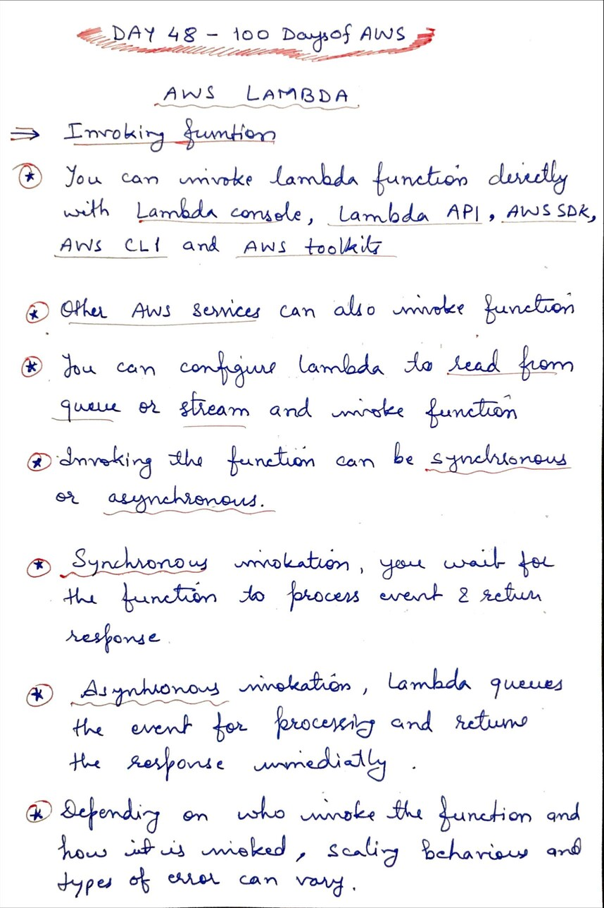
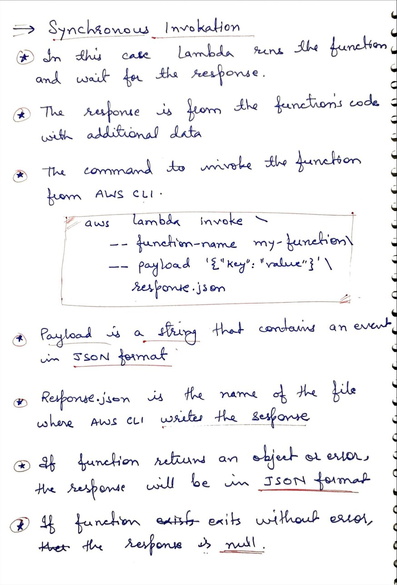
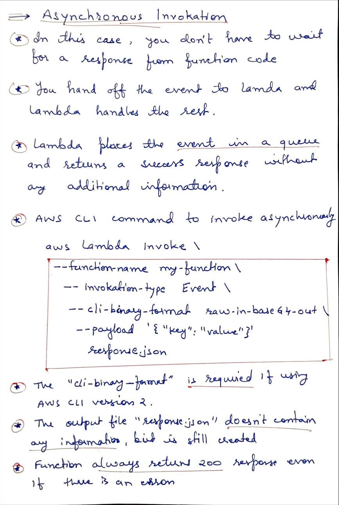

# Day 48 AWS Lambda Invokation Types

**Congrat, since you are here this means you have completed Day 47 and working on Day 48**

## Hands on video

## Topics
  - What is Invoking function
  - synchronous Invoking
  - Asynchronous Invoking

## My Notes
  
  
  

