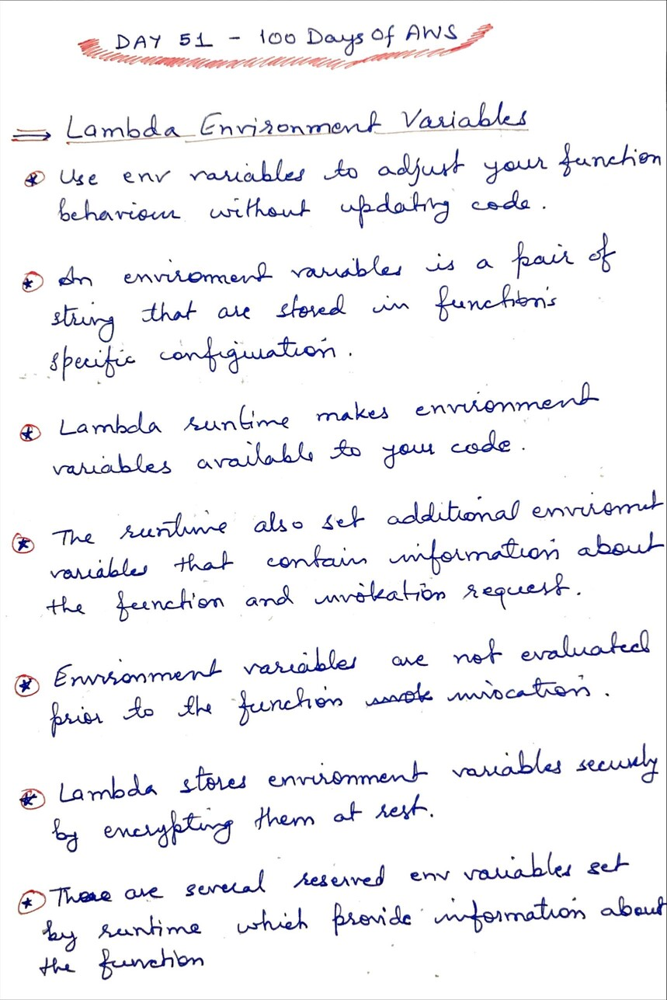
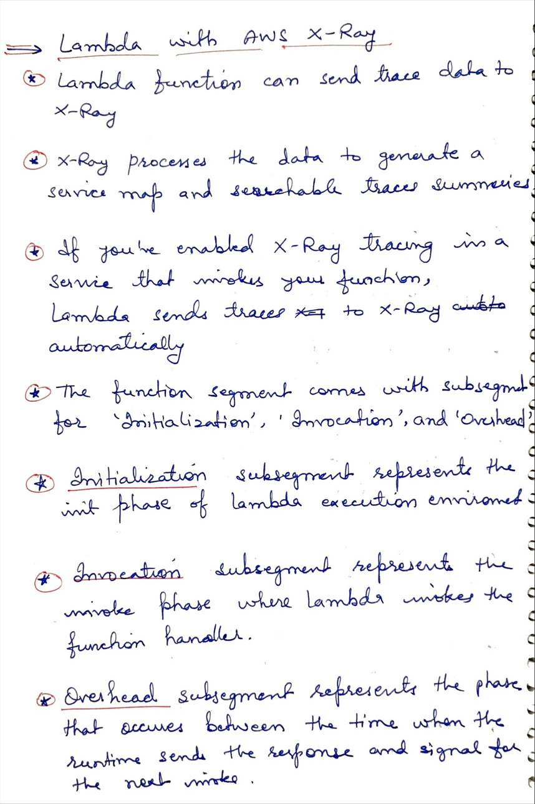
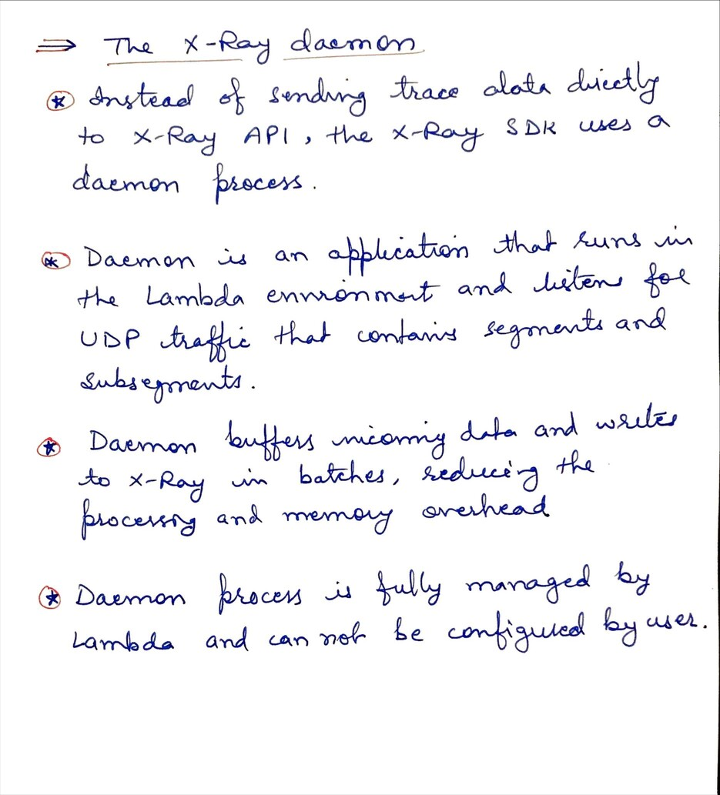

# Day 50 AWS Lambda - Event Source Mapping

**Congrat, since you are here this means you have completed Day 49 and working on Day 50**

## Hands on video

## Topics
  - Lambda environment variables
  - Lambda with X-Ray
  - X-Ray Daemon

## My Notes
  
  
  
