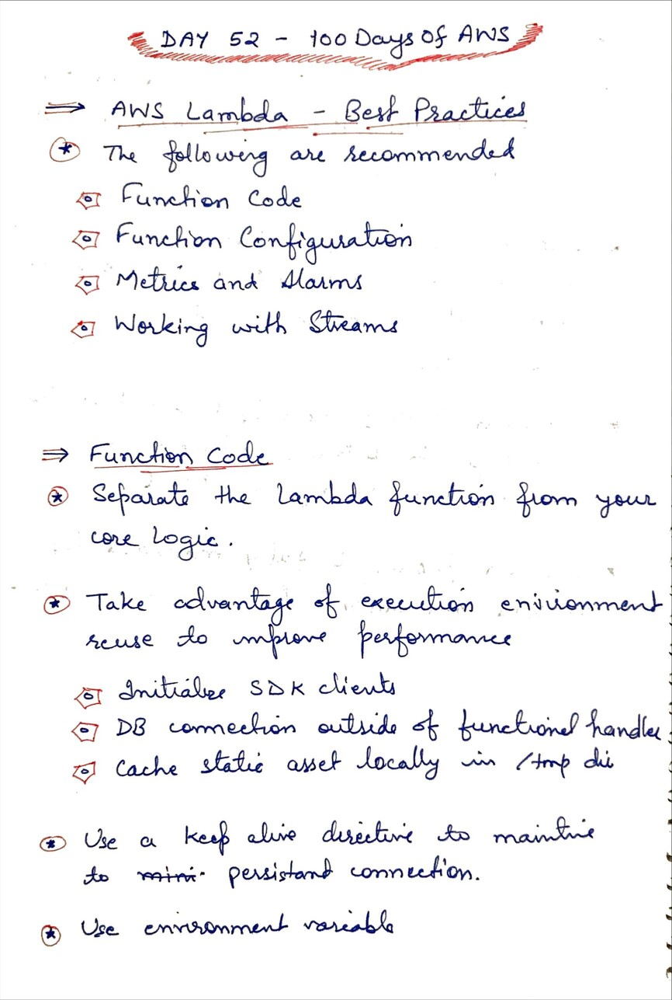
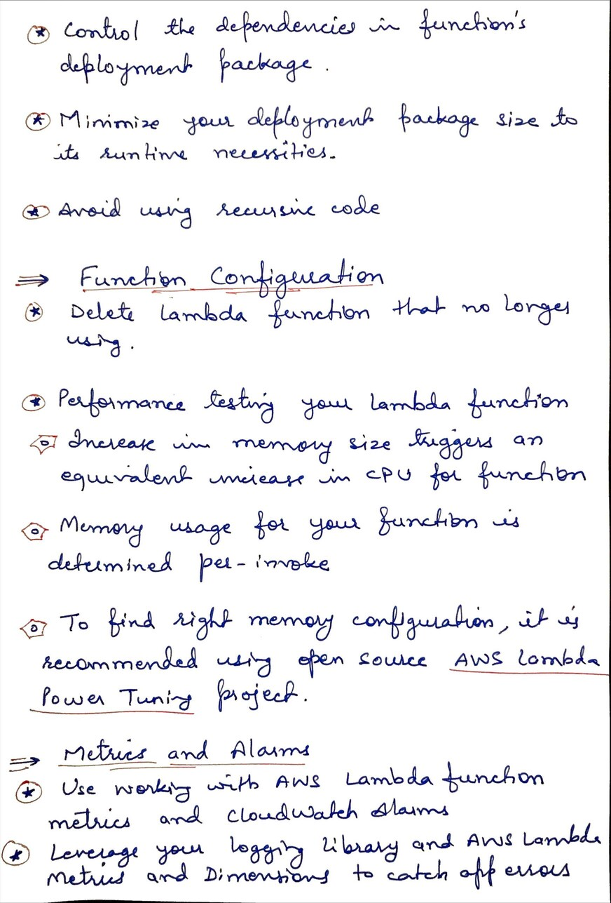

# Day 52 AWS Lambda - Best Practices

**Congrat, since you are here this means you have completed Day 50 and working on Day 52**

## Hands on video

## Topics
  - AWS Lambda Best Practices

## My Notes
  
  
