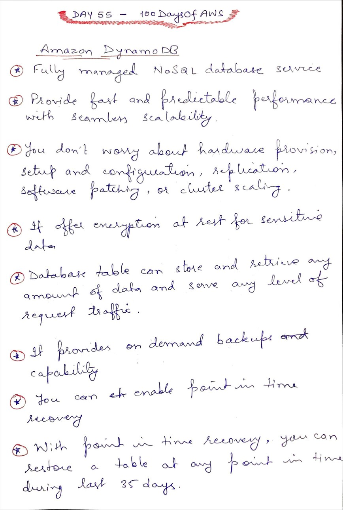
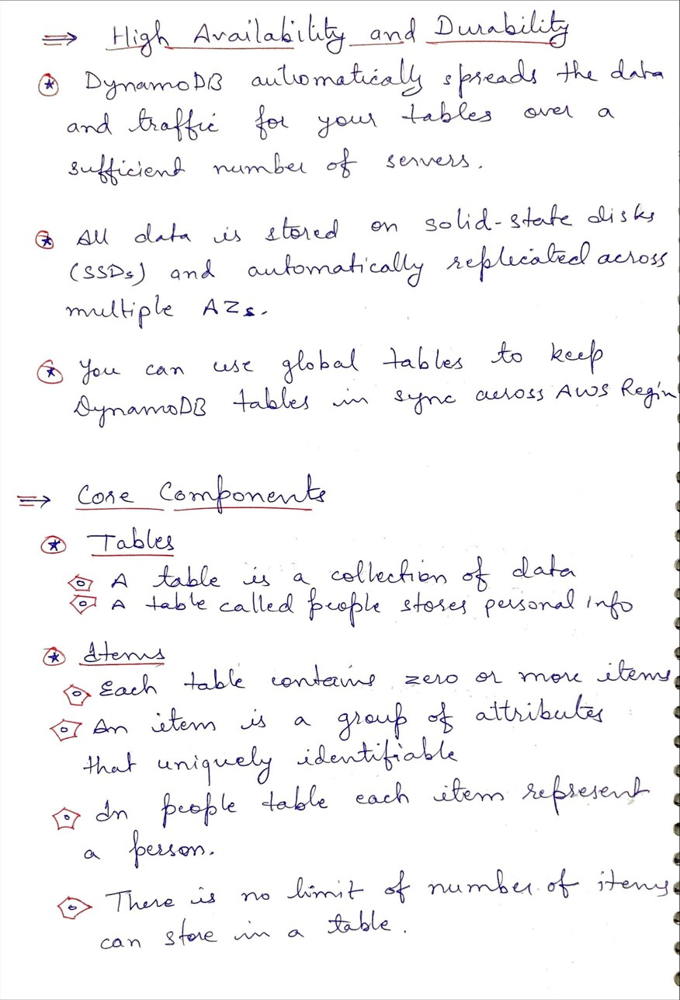
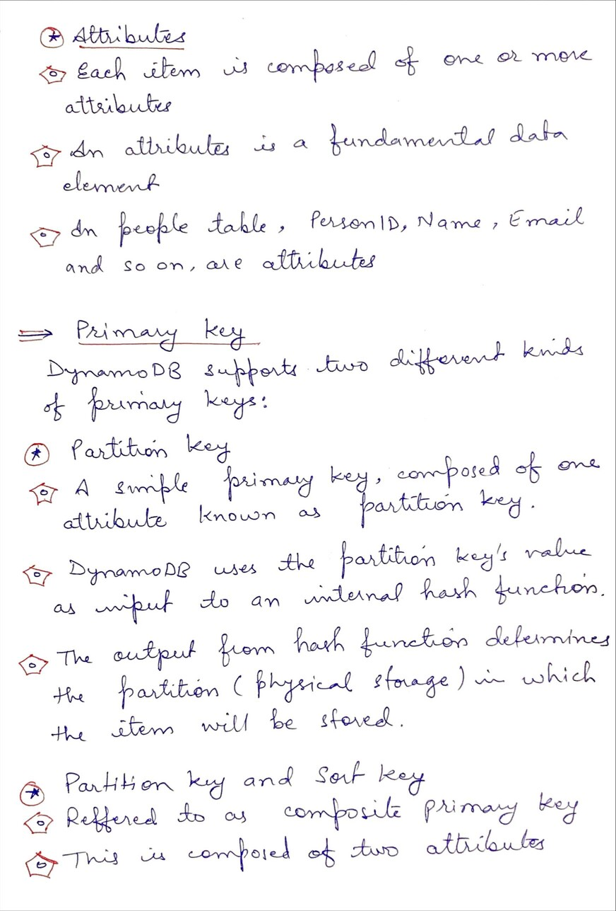
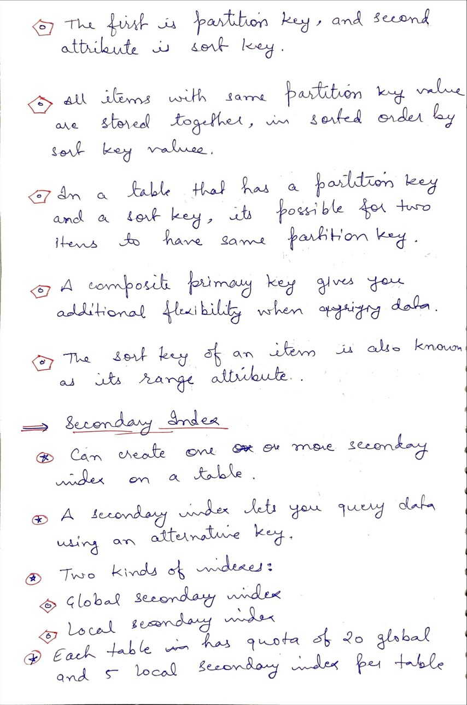

# Day 55 AWS Dynamo DB

**Congrat, since you are here this means you have completed Day 54 and working on Day 55**

## Hands on video

## Topics
  - What is DynamoDB
  - Core Components
  - Primary Key
  - Secondary Index

## My Notes
  
  
  
  

