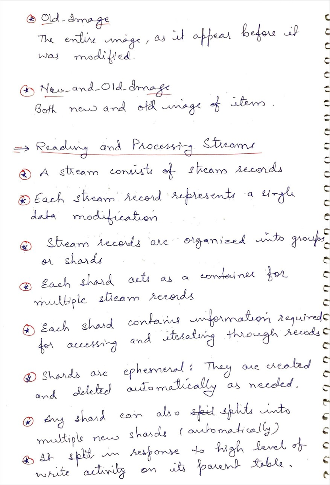
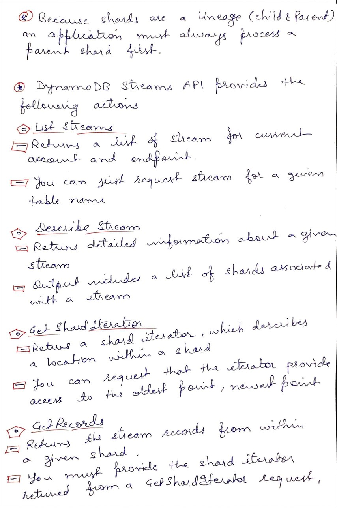

# Day 56 AWS Dynamo DB Streams

**Congrat, since you are here this means you have completed Day 55 and working on Day 56**

## Hands on video

## Topics
  - What is DynamoDB Stream
  - Stream View Types
  - Stream Shards

## My Notes
  
  
  
