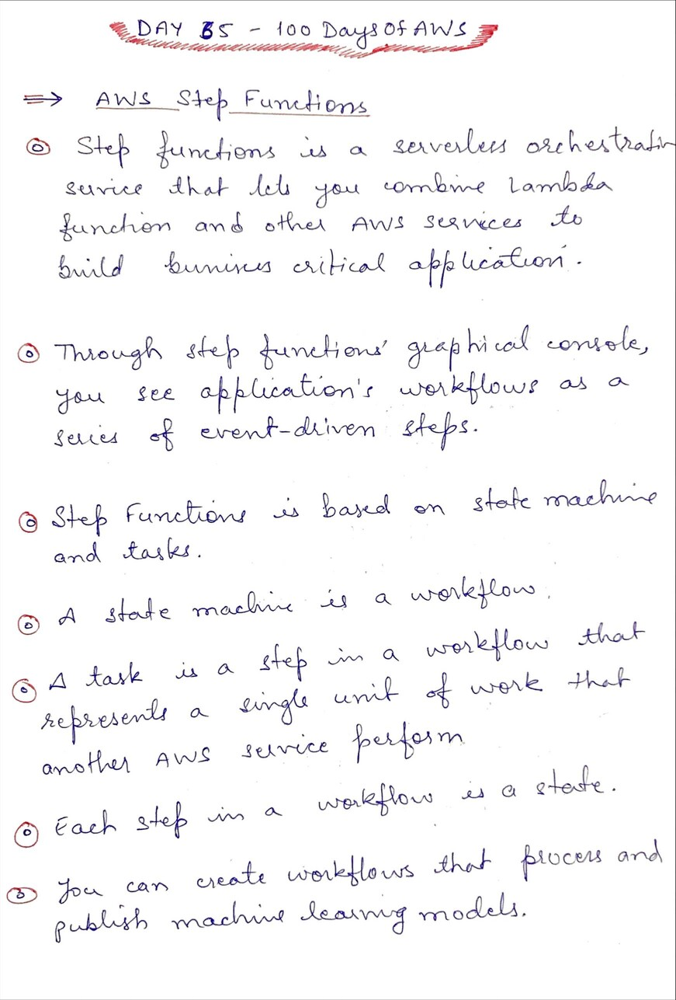
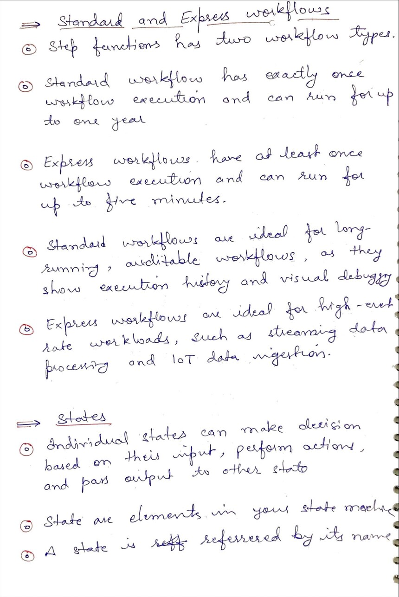
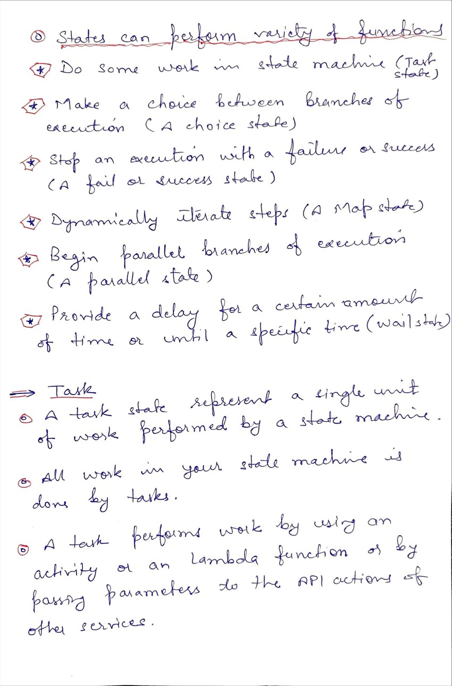

# Day 65 AWS Step Functions

**Congrat, since you are here this means you have completed Day 64 and working on Day 65**

## Hands on video

## Topics
  - What is Step Functions
  - Standard & Express Workflow
  - States
  - Tasks

## My Notes
  
  
  

