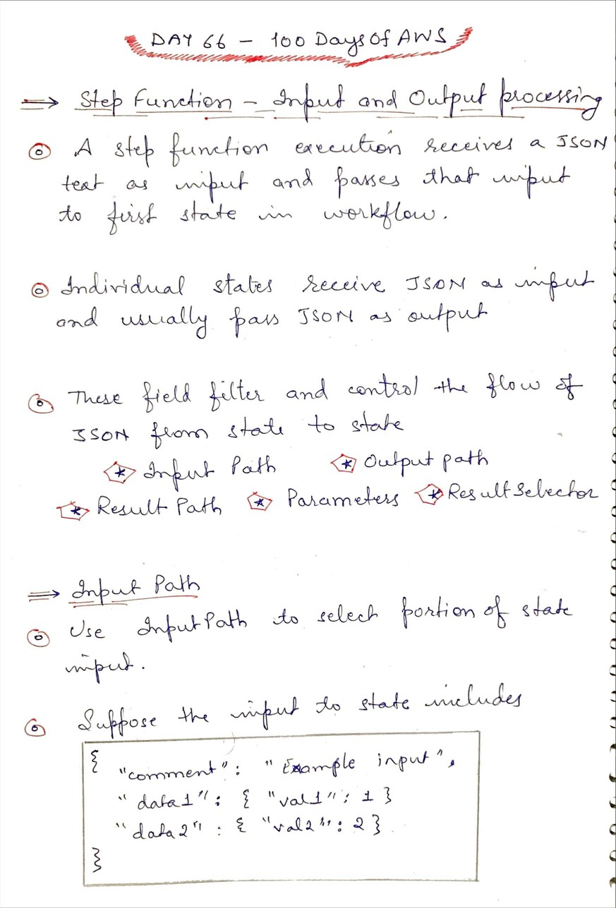
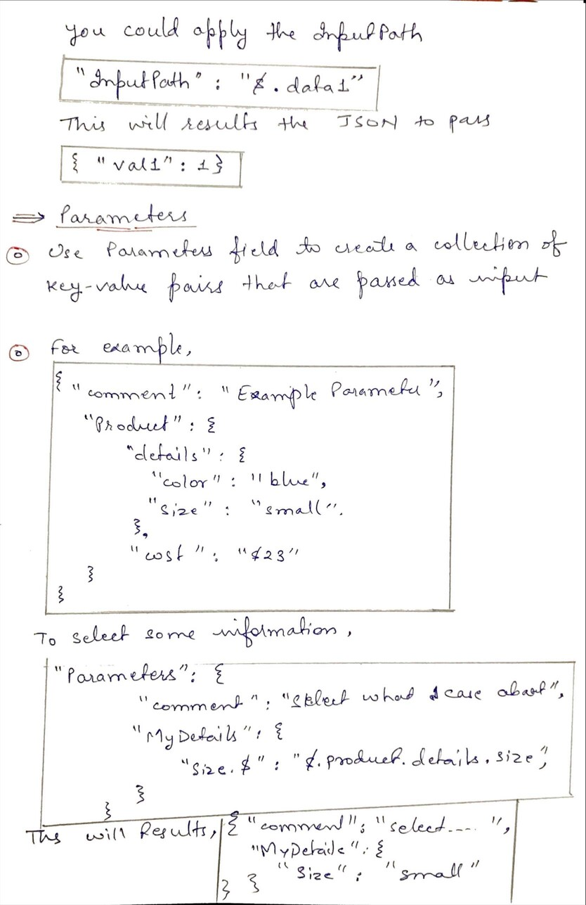
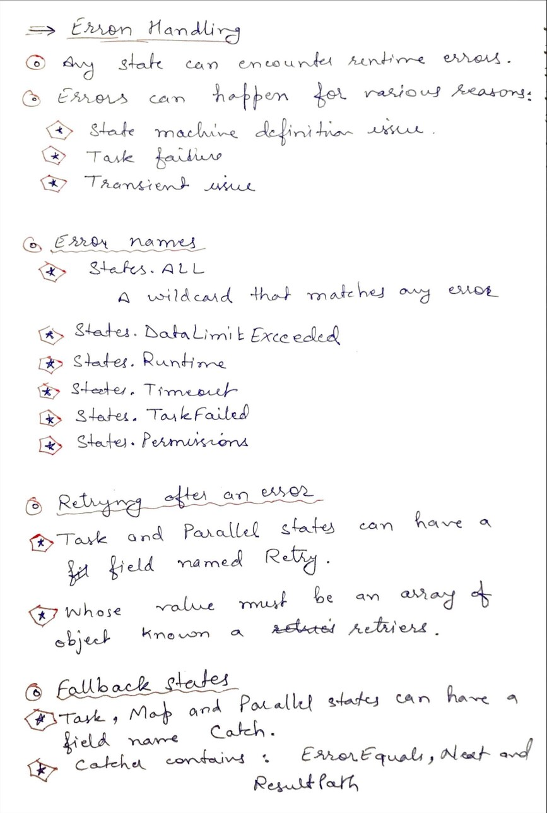

# Day 66 AWS Step Functions

**Congrat, since you are here this means you have completed Day 65 and working on Day 66**

## Hands on video

## Topics
  - Step Function Input Output
  - Error Handling

## My Notes
  
  
  
