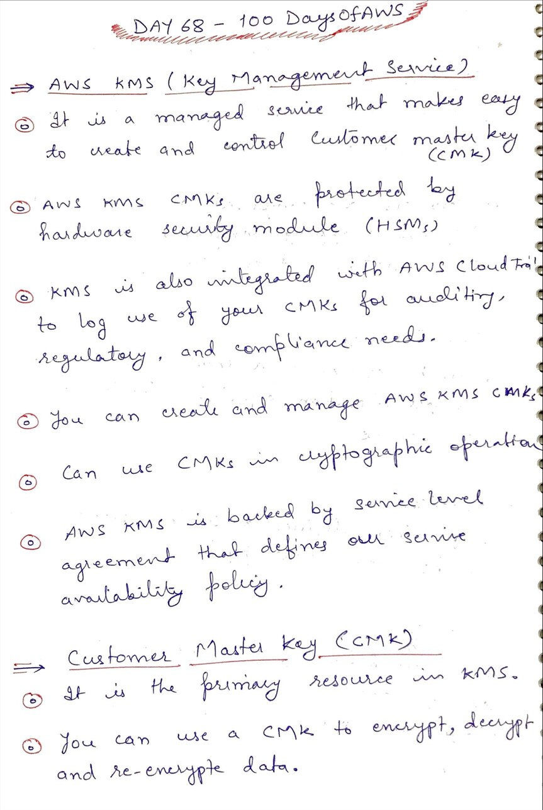
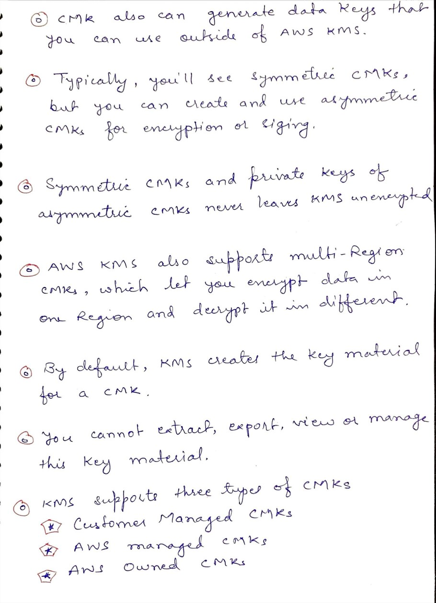

# Day 68 AWS Key Management Service

**Congrat, since you are here this means you have completed Day 67 and working on Day 68**

## Hands on video

## Topics
  - What is KMS
  - Customer Master Key (CMKs)
  - Customer Managed CMKs
  - AWS Managed CMKs
  - AWS Owned CMKs

## My Notes
  
  
  
