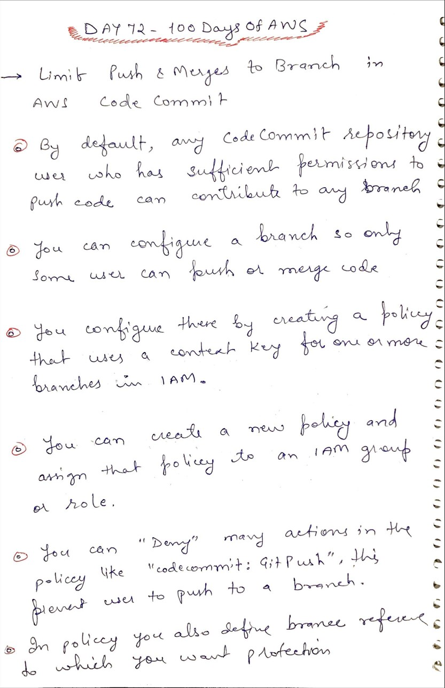

# Day 72 AWS CodeCommit Branch Protection

**Congrat, since you are here this means you have completed Day 71 and working on Day 72**

## Hands on video

## Topics
  - How to define policy to protect branch from deleting or creating new branch

## My Notes

